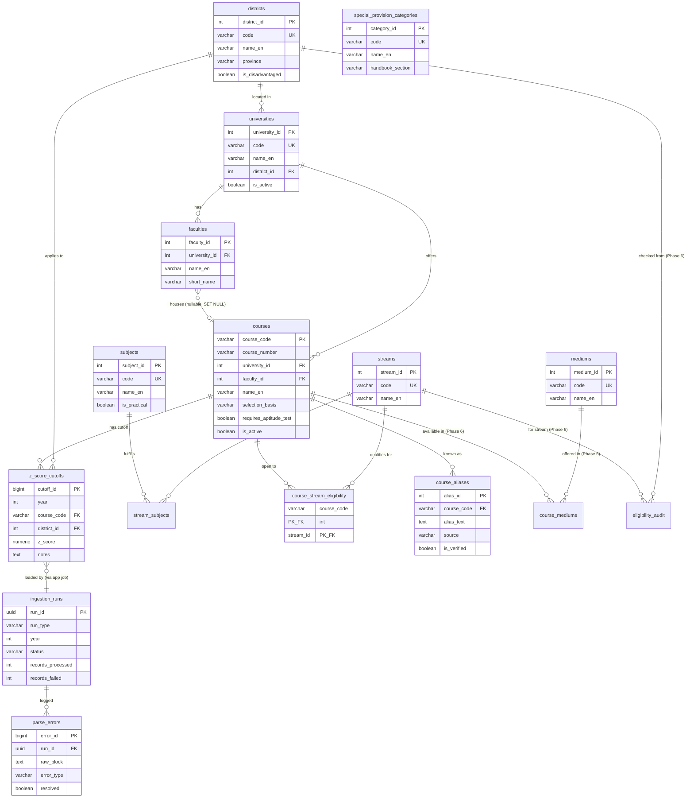

# Database Reference — degree_guidance
## **Fully verified against pg_dump on 2025-XX-XX. All 14 user tables documented.**

This document provides three views of the database:
1. **Markdown table-by-table reference** (human-readable)
2. **Mermaid ER diagram** (visual relationships)
3. **Pointer to authoritative SQL DDL** (the `schema.sql` from pg_dump uploaded with the handoff package)

Plus **complete seeded reference data** for districts, streams, and mediums.

---

## Extensions installed

The database requires these PostgreSQL extensions:
```sql
CREATE EXTENSION IF NOT EXISTS pgcrypto;  -- for gen_random_uuid()
CREATE EXTENSION IF NOT EXISTS vector;    -- pgvector, for RAG phases
```

Both are confirmed present in the current database.

---

## All tables (15 total: 14 user + 1 alembic)

| # | Table | Created in | Rows | Purpose |
|---|---|---|---|---|
| 1 | `alembic_version` | Alembic init | 1 | Tracks current migration version |
| 2 | `districts` | Migration 01 | 25 | Sri Lankan administrative districts |
| 3 | `streams` | Migration 02 | 7 | A/L streams (incl. ICT) |
| 4 | `subjects` | Migration 03 | 35 | A/L subjects |
| 5 | `stream_subjects` | Migration 04 | 50 | Bridge: which subjects belong to each stream |
| 6 | `mediums` | Migration 05 | 3 | Languages of instruction (SI/TA/EN) |
| 7 | `universities` | Migration 06 | 21 | Universities and institutes |
| 8 | `faculties` | Migration 07 | 0 | Empty; reserved for future use |
| 9 | `special_provision_categories` | Migration 08 | 6 | Special quota categories (handbook §X) |
| 10 | `courses` | Migrations 09-11, 16 | 266 | Degree programs |
| 11 | `course_stream_eligibility` | Migrations 12, 16 | 626 | Which streams can apply to which courses |
| 12 | `course_aliases` | Migrations 13, 16 | 532 | OCR label → course_code mapping (includes 266 self-aliases) |
| 13 | `z_score_cutoffs` | Migration 14 | 6,525 | Cutoff data (year=2023 only currently) |
| 14 | `ingestion_runs` | Migration 15 | 4 | Per-run accounting of ingestion jobs |
| 15 | `parse_errors` | Migration 15 | 0 | Triage queue for unresolved ingestion rows |

---

## Conventions used throughout

- All `*_id` columns are INTEGER PK with auto-incrementing SERIAL sequence (except `cutoff_id`/`error_id` which are BIGSERIAL, and `run_id` which is UUID).
- All `code` columns are uppercase short identifiers (e.g., `COLOMBO`, `BIO_SCIENCE`, `EN`).
- Multi-language `name_*` columns: `name_en` always required, `name_si`/`name_ta` optional.
- Timestamp columns: `TIMESTAMPTZ DEFAULT now()`.
- FK ON DELETE policies: `RESTRICT` for data-integrity-critical, `CASCADE` for child cleanup, `SET NULL` for soft refs.

---

## 1. Markdown Table-by-Table Reference

### Reference tables (Phase 2)

#### `districts` (25 rows) ✓ verified
Sri Lankan administrative districts.
| Column | Type | Constraints |
|---|---|---|
| `district_id` | INTEGER (SERIAL) | **PK** |
| `code` | VARCHAR(20) | NOT NULL, UNIQUE (`districts_code_key`) — uppercase, underscores for multi-word |
| `name_en` | VARCHAR(50) | NOT NULL |
| `name_si` | VARCHAR(100) | |
| `name_ta` | VARCHAR(100) | |
| `province` | VARCHAR(50) | (Sri Lankan province name) |
| `is_disadvantaged` | BOOLEAN | NOT NULL DEFAULT FALSE |
| `created_at` | TIMESTAMPTZ | NOT NULL DEFAULT now() |

#### `streams` (7 rows) ✓ verified
A/L streams.
| Column | Type | Constraints |
|---|---|---|
| `stream_id` | INTEGER (SERIAL) | **PK** |
| `code` | VARCHAR(30) | NOT NULL, UNIQUE (`streams_code_key`) |
| `name_en` | VARCHAR(50) | NOT NULL |
| `name_si` | VARCHAR(100) | |
| `name_ta` | VARCHAR(100) | |
| `description` | TEXT | |

#### `subjects` (35 rows) ✓ verified
A/L subjects.
| Column | Type | Constraints |
|---|---|---|
| `subject_id` | INTEGER (SERIAL) | **PK** |
| `code` | VARCHAR(30) | NOT NULL, UNIQUE (`subjects_code_key`) |
| `name_en` | VARCHAR(100) | NOT NULL |
| `name_si` | VARCHAR(150) | |
| `name_ta` | VARCHAR(150) | |
| `is_practical` | BOOLEAN | NOT NULL DEFAULT FALSE |

#### `stream_subjects` (50 rows) ✓ verified
Bridge table linking streams to allowed subjects.
| Column | Type | Constraints |
|---|---|---|
| `stream_id` | INTEGER | NOT NULL, FK → `streams.stream_id` ON DELETE CASCADE |
| `subject_id` | INTEGER | NOT NULL, FK → `subjects.subject_id` ON DELETE CASCADE |
| **PK** | composite (stream_id, subject_id) | |

#### `mediums` (3 rows) ✓ verified
Languages of instruction.
| Column | Type | Constraints |
|---|---|---|
| `medium_id` | INTEGER (SERIAL) | **PK** |
| `code` | VARCHAR(10) | NOT NULL, UNIQUE (`mediums_code_key`) |
| `name_en` | VARCHAR(50) | NOT NULL |

#### `universities` (21 rows) ✓ verified
Universities and institutes.
| Column | Type | Constraints |
|---|---|---|
| `university_id` | INTEGER (SERIAL) | **PK** |
| `code` | VARCHAR(20) | NOT NULL, UNIQUE (`universities_code_key`) |
| `name_en` | VARCHAR(150) | NOT NULL |
| `name_si` | VARCHAR(200) | |
| `name_ta` | VARCHAR(200) | |
| `short_name` | VARCHAR(50) | |
| `district_id` | INTEGER | FK → `districts.district_id` ON DELETE SET NULL |
| `website_url` | TEXT | |
| `established` | INTEGER | |
| `is_active` | BOOLEAN | NOT NULL DEFAULT TRUE |

#### `faculties` (0 rows — empty) ✓ verified
| Column | Type | Constraints |
|---|---|---|
| `faculty_id` | INTEGER (SERIAL) | **PK** |
| `university_id` | INTEGER | NOT NULL, FK → `universities.university_id` ON DELETE CASCADE |
| `name_en` | VARCHAR(200) | NOT NULL |
| `short_name` | VARCHAR(50) | |
| `website_url` | TEXT | |
| **UNIQUE** | `uq_faculty_per_university (university_id, name_en)` | |

Currently empty. Will be populated in a future phase if needed.

#### `special_provision_categories` (6 rows) ✓ verified
| Column | Type | Constraints |
|---|---|---|
| `category_id` | INTEGER (SERIAL) | **PK** |
| `code` | VARCHAR(30) | NOT NULL, UNIQUE (`special_provision_categories_code_key`) |
| `name_en` | VARCHAR(100) | NOT NULL |
| `description` | TEXT | |
| `handbook_section` | VARCHAR(20) | (cross-reference into the handbook) |

---

### Course tables (Phase 3 + Migration 16)

#### `courses` (266 rows) ✓ verified
| Column | Type | Constraints |
|---|---|---|
| `course_code` | VARCHAR(15) | **PK** |
| `course_number` | VARCHAR(5) | indexed (`idx_courses_number`) |
| `university_id` | INTEGER | NOT NULL, FK → `universities.university_id` ON DELETE RESTRICT, indexed (`idx_courses_university`) |
| `faculty_id` | INTEGER | FK → `faculties.faculty_id` ON DELETE SET NULL |
| `name_en` | VARCHAR(300) | NOT NULL |
| `name_si` | VARCHAR(400) | |
| `name_ta` | VARCHAR(400) | |
| `degree_type` | VARCHAR(50) | |
| `duration_years` | NUMERIC(3,1) | |
| `selection_basis` | VARCHAR(20) | NOT NULL DEFAULT `'district_quota'`, CHECK in `('district_quota', 'all_island_merit')` (`ck_courses_selection_basis`), indexed (`idx_courses_selection_basis`) |
| `requires_aptitude_test` | BOOLEAN | NOT NULL DEFAULT FALSE |
| `description` | TEXT | |
| `career_outlook` | TEXT | |
| `is_active` | BOOLEAN | NOT NULL DEFAULT TRUE, indexed (partial `idx_courses_active WHERE is_active = TRUE`) |
| `first_intake_year` | INTEGER | |
| `metadata` | JSONB | NOT NULL DEFAULT `'{}'` |
| `created_at` | TIMESTAMPTZ | NOT NULL DEFAULT now() |
| `updated_at` | TIMESTAMPTZ | NOT NULL DEFAULT now() |

**Column comments (set on the table):**
- `selection_basis`: "Set via manual seed from handbook Section 1.1 and Section 9 markers. Not derived from cutoff CSV data — OCR does not capture the * marker."
- `requires_aptitude_test`: "Set via manual seed from handbook Section 9 # markers. Not derived from cutoff CSV data."

---

### Eligibility tables (Phase 4 + Migration 16)

#### `course_stream_eligibility` (626 rows) ✓ verified
| Column | Type | Constraints |
|---|---|---|
| `course_code` | VARCHAR(15) | NOT NULL, FK → `courses.course_code` ON DELETE CASCADE |
| `stream_id` | INTEGER | NOT NULL, FK → `streams.stream_id` |
| **PK** | composite (course_code, stream_id) | |

#### `course_aliases` (532 rows) ✓ verified
OCR/extractor label → canonical course_code mapping. Includes 266 **self-aliases** where `alias_text = course_code` (added via raw SQL in Phase 5; will become a migration via Cleanup #3).

| Column | Type | Constraints |
|---|---|---|
| `alias_id` | INTEGER (SERIAL) | **PK** |
| `course_code` | VARCHAR(15) | NOT NULL, FK → `courses.course_code` ON DELETE CASCADE, indexed (`idx_aliases_course`) |
| `alias_text` | TEXT | NOT NULL, indexed via GIN tsvector (`idx_aliases_text`) |
| `source` | VARCHAR(50) | |
| `confidence` | NUMERIC(3,2) | |
| `is_verified` | BOOLEAN | NOT NULL DEFAULT FALSE |
| `created_at` | TIMESTAMPTZ | NOT NULL DEFAULT now() |
| **UNIQUE** | `uq_alias_per_course (alias_text, course_code)` | |

Source values currently in use:
- `manual_seed_2024_handbook` — original 261 aliases from Phase 4
- `manual_seed_2024_handbook_fix` — 5 new aliases from Migration 16
- `unicode_self_alias` — 266 self-aliases (one per course)

---

### Cutoff & ingestion tables (Phase 5)

#### `z_score_cutoffs` (6,525 rows — year=2023 only) ✓ verified
| Column | Type | Constraints |
|---|---|---|
| `cutoff_id` | BIGINT (BIGSERIAL) | **PK** |
| `year` | INTEGER | NOT NULL — A/L **exam** year (NOT handbook publication year) |
| `course_code` | VARCHAR(15) | NOT NULL, FK → `courses.course_code` ON DELETE RESTRICT |
| `district_id` | INTEGER | NOT NULL, FK → `districts.district_id` ON DELETE RESTRICT |
| `z_score` | NUMERIC(6,4) | nullable — NULL = "NQC" (No Qualified Candidates) |
| `notes` | TEXT | |
| `created_at` | TIMESTAMPTZ | NOT NULL DEFAULT now() |

**Constraints & indexes:**
- `uq_zscore_year_course_district` UNIQUE on `(year, course_code, district_id)`
- `idx_zscore_course_history` on `(course_code, year)` — trend queries
- `idx_zscore_district_lookup` on `(year, district_id, z_score)` **PARTIAL WHERE z_score IS NOT NULL** — hot path

**Column comments (set on the table):**
- `year`: "Academic year of the A/L examination that produced these cutoffs. NOT the handbook publication year. The 2024/2025 handbook contains year=2023 cutoffs (from A/L 2023)."
- `z_score`: "Z-score range observed in handbook data: approximately [-0.7, +2.9]. Validator range: [-2.0, +3.0]. NULL = NQC (No Qualified Candidates)."

#### `ingestion_runs` (4 rows) ✓ verified
| Column | Type | Constraints |
|---|---|---|
| `run_id` | UUID | **PK** DEFAULT `gen_random_uuid()` |
| `run_type` | VARCHAR(30) | NOT NULL |
| `source_label` | VARCHAR(100) | |
| `year` | INTEGER | |
| `status` | VARCHAR(20) | NOT NULL, CHECK in `('running','success','failed','partial')` (`chk_run_status`) |
| `started_at` | TIMESTAMPTZ | NOT NULL DEFAULT now() |
| `completed_at` | TIMESTAMPTZ | |
| `records_processed` | INTEGER | |
| `records_failed` | INTEGER | |
| `triggered_by` | VARCHAR(100) | |
| `notes` | TEXT | |
| `error_log` | TEXT | |

#### `parse_errors` (0 rows) ✓ verified
| Column | Type | Constraints |
|---|---|---|
| `error_id` | BIGINT (BIGSERIAL) | **PK** |
| `run_id` | UUID | FK → `ingestion_runs.run_id` ON DELETE CASCADE |
| `source_label` | VARCHAR(100) | |
| `page_number` | INTEGER | |
| `raw_block` | TEXT | |
| `error_type` | VARCHAR(50) | |
| `error_message` | TEXT | |
| `resolved` | BOOLEAN | NOT NULL DEFAULT FALSE |
| `resolved_action` | TEXT | |
| `created_at` | TIMESTAMPTZ | NOT NULL DEFAULT now() |
| **Index** | `idx_parse_errors_run (run_id, resolved)` | |

---

### Phase 6 tables (NOT YET CREATED)

These don't exist yet. Phase 6's migration must create them:

#### `course_mediums` (planned)
- `course_code` VARCHAR(15) FK → `courses.course_code` ON DELETE CASCADE
- `medium_id` INTEGER FK → `mediums.medium_id` ON DELETE CASCADE
- PK: composite `(course_code, medium_id)`
- Initially empty; populated by admin later.

#### `eligibility_audit` (planned)
- `audit_id` BIGSERIAL PK
- `request_hash` VARCHAR(64) NOT NULL — SHA256 of normalized inputs
- `user_id` UUID nullable — no FK yet (Phase 8 will add `users` table + FK)
- `z_score`, `district_id`, `stream_id`, `cutoff_year_used`, `eligible_count`, `conditional_count`, `confidence_tier`
- `result_payload` JSONB NOT NULL — full response for forensic replay
- `latency_ms` INTEGER
- `created_at` TIMESTAMPTZ
- Indexes: `idx_eligibility_audit_hash`, `idx_eligibility_audit_user`

---

## 2. Complete seeded reference data

These values are static and confirmed by query. The new chat can rely on them without re-querying.

### Districts (25 rows)
| ID | code | name_en |
|----|------|---------|
| 1 | COLOMBO | Colombo |
| 2 | GAMPAHA | Gampaha |
| 3 | KALUTARA | Kalutara |
| 4 | KANDY | Kandy |
| 5 | MATALE | Matale |
| 6 | NUWARA_ELIYA | Nuwara Eliya |
| 7 | GALLE | Galle |
| 8 | MATARA | Matara |
| 9 | HAMBANTOTA | Hambantota |
| 10 | JAFFNA | Jaffna |
| 11 | KILINOCHCHI | Kilinochchi |
| 12 | MANNAR | Mannar |
| 13 | VAVUNIYA | Vavuniya |
| 14 | MULLAITIVU | Mullaitivu |
| 15 | BATTICALOA | Batticaloa |
| 16 | AMPARA | Ampara |
| 17 | TRINCOMALEE | Trincomalee |
| 18 | KURUNEGALA | Kurunegala |
| 19 | PUTTALAM | Puttalam |
| 20 | ANURADHAPURA | Anuradhapura |
| 21 | POLONNARUWA | Polonnaruwa |
| 22 | BADULLA | Badulla |
| 23 | MONARAGALA | Monaragala |
| 24 | RATNAPURA | Ratnapura |
| 25 | KEGALLE | Kegalle |

⚠ **NUWARA_ELIYA uses underscore**, not space. This trips up ingestion if not normalized.

### Streams (7 rows)
| ID | code | name_en |
|----|------|---------|
| 1 | ARTS | Arts |
| 2 | COMMERCE | Commerce |
| 3 | BIO_SCIENCE | Biological Science |
| 4 | PHYSICAL_SCIENCE | Physical Science |
| 5 | ENGINEERING_TECH | Engineering Technology |
| 6 | BIOSYSTEMS_TECH | Biosystems Technology |
| 7 | ICT | Information Communication Technology |

⚠ **`ENGINEERING_TECH`**, not `ENG_TECH`. The abbreviation does not exist in the DB.

### Mediums (3 rows)
| ID | code | name_en |
|----|------|---------|
| 1 | SI | Sinhala |
| 2 | TA | Tamil |
| 3 | EN | English |

---

## 3. Mermaid ER Diagram



---

## 4. SQL DDL

The authoritative DDL is in `schema.sql` (uploaded with the handoff package), generated by:
```bash
PGPASSWORD='123456' pg_dump --schema-only \
    -h localhost -U degree_app -d degree_guidance \
    > schema.sql
```

This file is 979 lines and covers every table, sequence, primary key, unique constraint, foreign key, index, comment, and extension. Treat it as the source of truth.

---

## 5. Important Conventions & Gotchas

1. **Migration file naming**: `<hash>_NN_<description>.py` where NN is the zero-padded migration number. The courses-fix file (`65a2d08989b1_add_5_missing_coursesfrom_2024_handbook.py`) is missing the `_16_` prefix — rename it before going further (see HANDOFF_PROMPT.md Cleanup #1).

2. **z_score_cutoffs.year is the A/L EXAM year**, NOT the handbook publication year. The 2024/25 handbook contains year=2023 cutoffs (from A/L 2023). This is also captured in the table's COMMENT.

3. **District codes use underscores**: `NUWARA_ELIYA`, not `NUWARA ELIYA` or `nuwara_eliya`. All uppercase.

4. **Stream code is `ENGINEERING_TECH`**, not `ENG_TECH`. Wrong code = silent failure (no FK error, just no rows inserted).

5. **Self-aliases in course_aliases**: The 266 rows where `alias_text = course_code` were inserted via RAW SQL during Phase 5, not via a migration. They exist in the DB but NOT in the migration history. Migration 17 (provided in handoff) formalizes them.

6. **Course 271D**: Not a typo. The handbook uses course numbers up to 271 for special-stream variants (e.g., MIT - Bio Science Stream). Don't be surprised by 3-digit course numbers >140.

7. **Course 006K is Applied Sciences, not Biological Science**: The handbook uses an unconventional code (course number 006 normally = BIOLOGICAL SCIENCE, but 006K specifically = APPLIED SCIENCES (BIO.SC) at Rajarata). Source: 2024/25 handbook page 180.

8. **Extensions**: `pgcrypto` (for `gen_random_uuid()` used in `ingestion_runs.run_id`) and `vector` (pgvector for the future RAG phases) must be installed. They ARE installed on the current DB.

9. **`alembic_version` table** tracks the migration state. Current value: `65a2d08989b1` (migration 16, the courses-fix). After Cleanup #3, this will advance to the new migration 17 hash.

10. **`z_score_cutoffs` only has year=2023 data**. The schema is designed for multi-year data, but currently only one handbook has been loaded. See HANDOFF_PROMPT.md Section 3 for the yearly handbook pattern.