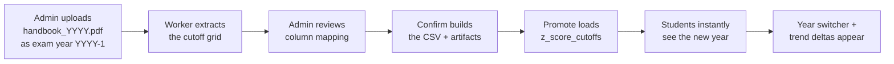
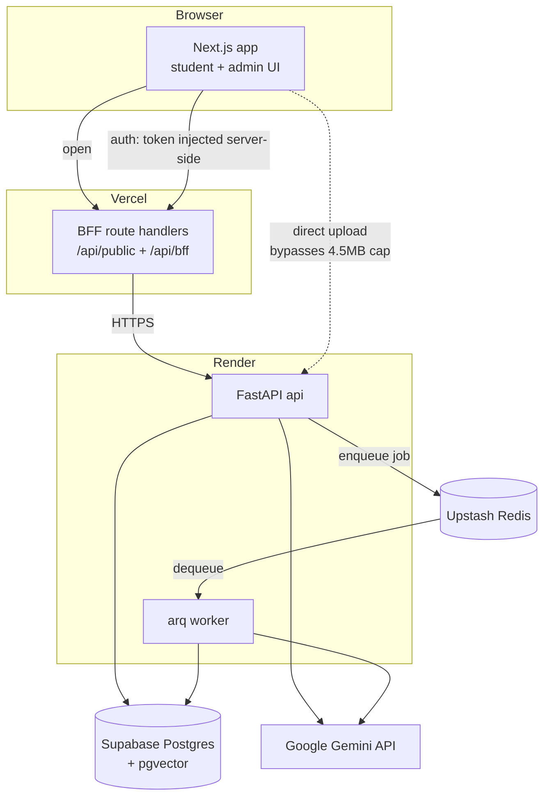
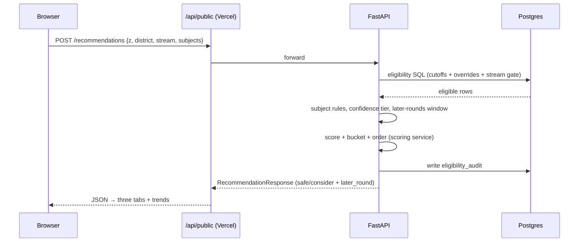

# System Overview & The Yearly Loop

## What this is / why it exists

Degree Guidance is a decision aid for Sri Lankan A/L students choosing a
university degree. Every year the UGC publishes a 200+ page handbook of
Z-score cutoffs across 21 universities, ~265 course-of-study codes, and a
25-district quota system where the *same* degree needs a different score in
Colombo than in Kandy. Students normally navigate this with word-of-mouth. This
platform replaces that with data: a deterministic eligibility check, a
transparent ranking, and an AI advisor grounded in the real handbooks.

This doc is the map. It explains the two audiences, the annual lifecycle that
the whole system is built around, the runtime shape, and how a single request
flows through the machine — then points you to the deep-dive docs.

---

## The two audiences

- **Students** (public, no account required). Enter Z-score, district, stream,
  and three A/L subjects → get a verified list of reachable courses, ranked and
  bucketed, with year switching, cutoff trends, and a chat advisor. Optionally
  sign in with Google to save chat history.
- **Admins** (authenticated). Run the yearly handbook ingestion, edit cutoffs,
  courses, factsheets, knowledge articles, and the AI agent's config, and review
  student conversations. Everything an admin changes is audited.

---

## The yearly loop — the lifecycle everything serves

The single most important thing to understand: this platform is built to ingest
**a new handbook every year, forever.** Nothing is hardcoded per year. The
annual loop:

| Stage | Who | Owned by |
| --- | --- | --- |
| Upload the handbook PDF (under the **exam year** = file year − 1) | Admin | `04-ingestion-pipeline.md` |
| Extract the rotated cutoff grid (async, on the worker) | System | `04-ingestion-pipeline.md` |
| Review & confirm the column→course mapping | Admin | `04` + `10-admin-frontend.md` |
| Promote → write cutoffs, overrides, codeless rows | Admin | `04-ingestion-pipeline.md` |
| Students see the new default year + trends | Students | `05` / `06` / `11` |

The three-book rehearsal (2022, 2023, 2024) proved this loop end-to-end on the
live production stack, with every promoted number independently verified against
the printed PDF.

---

## Runtime shape — a modular monolith, two processes

The system is **one codebase, deployed as two processes**, sharing a `core/`
package and one Postgres database:

- **`apps/api`** — the FastAPI web service. Handles all HTTP: eligibility,
  recommendations, chat, and every admin endpoint.
- **`apps/worker`** — the arq background worker. Handles the slow, CPU-heavy,
  or provider-bound jobs: PDF extraction, factsheet/article embedding.

This is deliberately **not microservices**. The domain is cohesive and the team
is one person; a monolith is easier to reason about and hand over. The split is
only where the work is genuinely asynchronous (a 5-minute PDF extraction cannot
block an HTTP request). See `12-infrastructure-deployment.md` for how the two
processes become two separate machines in production and why that forced the DB
artifact store.

---

## Two request walkthroughs

### A student eligibility + recommendation check

### A student chat message

The chat request (documented fully in `08-ai-agent.md`) carries the student's
profile and eligible-course list as `context`. The agent runs a bounded
tool-calling loop on Gemini, fetching exact facts from the DB and the knowledge
base, and returns a grounded answer plus the list of tools it used.

---

## The philosophy threads that recur everywhere

These five ideas show up in every subsystem (full treatment in
`16-design-decisions.md`):

1. **Deterministic on the critical path** — SQL, never an LLM, decides
   eligibility.
2. **Year-agnostic / data-derived** — no hardcoded years or counts; even the AI
   prompt injects `{latest_year}` etc. at request time.
3. **Additive-only migrations** — the schema only grows; 43 migrations, applied
   in a guarded chain.
4. **Verification-first** — prove promoted data against the printed PDF; guard
   the engine with an independent test oracle.
5. **Fix generally, never per-case** — every bug fix addresses the whole class.

---

## Where to go next

| You want to understand… | Read |
| --- | --- |
| Every technology and why | `02-tech-stack.md` |
| The database tables & relationships | `03-data-model.md` |
| How a PDF becomes cutoffs | `04-ingestion-pipeline.md` |
| Who-can-get-in logic | `05-eligibility-engine.md` |
| Ranking & the three tabs | `06-scoring-recommendations.md` |
| The AI knowledge base (RAG) | `07-rag-knowledge.md` |
| The chat advisor | `08-ai-agent.md` |
| Admin API & pages | `09-admin-backend.md`, `10-admin-frontend.md` |
| The student UI | `11-student-frontend.md` |
| Production topology & deploy | `12-infrastructure-deployment.md` |
| Auth & security | `13-auth-security.md` |
| Tests | `14-testing-quality.md` |
| What every file does | `15-file-map.md` |
| Why it's built this way + war stories | `16-design-decisions.md` |
