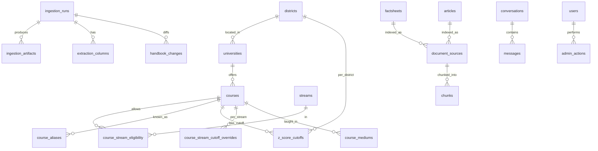

# The Data Model

## What this is / why it exists

One PostgreSQL database is the single source of truth for *everything* — cutoffs,
courses, AI knowledge + embeddings, chat history, the ingestion pipeline's
intermediate artifacts, and the audit trail. This doc enumerates the tables, how
they relate, and the two conventions that trip people up (the year meaning and
the cutoff-override resolution). The schema is defined as SQLAlchemy ORM models
in `core/models/*.py` and evolved by **43 additive Alembic migrations**.

> **Jargon.** *ORM model* = a Python class mirroring a table. *PK* = primary key.
> *FK* = foreign key (a column pointing at another table's PK). *JSONB* = a
> Postgres column that stores arbitrary JSON, queryable. *`vector(768)`* = a
> pgvector column holding a 768-number embedding.

---

## Model files

| File | Tables |
| --- | --- |
| `core/models/reference.py` | `districts`, `streams`, `subjects`, `stream_subjects`, `mediums`, `universities`, `faculties`, `special_provision_categories` |
| `core/models/course.py` | `courses` |
| `core/models/course_eligibility.py` | `course_stream_eligibility`, `course_aliases` |
| `core/models/course_requirements.py` | `course_requirements` |
| `core/models/cutoffs.py` | `z_score_cutoffs`, `course_stream_cutoff_overrides`, `unmapped_cutoffs`, `ingestion_runs`, `ingestion_artifacts`, `extraction_columns`, `handbook_changes`, `parse_errors` |
| `core/models/eligibility.py` | `eligibility_audit`, `course_mediums` |
| `core/models/rag.py` | `factsheets`, `articles`, `document_sources`, `chunks` |
| `core/models/chat.py` | `conversations`, `messages`, `agent_configs` |
| `core/models/auth.py` | `users`, `admin_actions`, `auth_events` |
| `core/models/scoring.py` | `scoring_config` |

---

## The table clusters

### 1. Reference data (static domain knowledge)

| Table | Key columns | Purpose |
| --- | --- | --- |
| `districts` | `district_id` PK, `code`, `is_disadvantaged` | 25 administrative districts |
| `streams` | `stream_id` PK, `code` | 6 A/L streams + ICT |
| `subjects` | `subject_id` PK, `code`, `is_practical` | ~30 A/L subjects |
| `stream_subjects` | (`stream_id`,`subject_id`) PK | which subjects belong to a stream |
| `mediums` | `medium_id` PK, `code` | Sinhala / Tamil / English |
| `universities` | `university_id` PK, `code`, `district_id` FK | 21 universities + HEIs |
| `faculties` | `faculty_id` PK, `university_id` FK | faculties (incremental) |
| `special_provision_categories` | `category_id` PK | Section-6 admission categories |

### 2. Courses & eligibility rules

| Table | Key columns | Purpose |
| --- | --- | --- |
| `courses` | `course_code` PK (the UGC Uni-Code, e.g. `012T`), `course_number` (3-digit, e.g. `012`), `university_id` FK, `selection_basis` (`district_quota`/`all_island_merit`), `requires_aptitude_test`, `is_active`, `metadata` JSONB | one row per course-university pair (~265 active) |
| `course_aliases` | `alias_text`+`course_code` unique | printed labels / abbreviations → code; grows as books are ingested (alias learning) |
| `course_stream_eligibility` | (`course_code`,`stream_id`) PK | the **allow-list** of streams that can apply — the engine's `EXISTS` gate. A course with no rows here is invisible to students (Phase 8 warns about this). |
| `course_requirements` | `course_number`, `exam_year` (NULL = baseline), JSONB rule tree | subject-combination prerequisites |

`course_code` vs `course_number`: `course_number` is the 3-digit course-of-study
(`012` = Computer Science); `course_code` appends a university letter (`012T` =
CS at UCSC). Factsheets key on the **number**; cutoffs key on the **code**.

### 3. Cutoffs (the heart of the data)

| Table | Key columns | Purpose |
| --- | --- | --- |
| `z_score_cutoffs` | `year`, `course_code`, `district_id`, `z_score` (nullable) | the main cutoff grid — ~6,500 rows/year |
| `course_stream_cutoff_overrides` | `year`, `course_code`, `district_id`, `stream_id`, `z_score` | per-stream cutoffs for split courses (e.g. 107L) |
| `unmapped_cutoffs` | `year`, `raw_label`, `district_id`, `z_score` | **codeless** columns — real z-scores with no Uni-Code in the book, kept verbatim |

### 4. Ingestion pipeline state (`04-ingestion-pipeline.md`)

| Table | Purpose |
| --- | --- |
| `ingestion_runs` | one row per upload/extract/promote run (status, notes, counts) |
| `ingestion_artifacts` | (`run_id`,`kind`) unique, `content` BYTEA — the **cross-instance artifact store** (pdf, grid.json, csv, snapshots…) |
| `extraction_columns` | one row per extracted cutoff column awaiting/holding its course mapping |
| `handbook_changes` | the diff: `course_added` / `course_removed` / `cutoff_changed` |
| `parse_errors` | rows the ingestion couldn't resolve |

### 5. RAG / knowledge (`07-rag-knowledge.md`)

| Table | Purpose |
| --- | --- |
| `factsheets` | `course_number` PK, `content`, `version`, `content_hash` — editable per-course prose |
| `articles` | `article_id` PK, `title`, `content`, `content_hash` — knowledge beyond courses (Phase 8.6) |
| `document_sources` | one indexed source (`source_type` = factsheet/article), `content_hash` (staleness signal) |
| `chunks` | chunked passages with `embedding vector(768)` + full-text `tsvector` |

### 6. Chat (`08-ai-agent.md`)

| Table | Purpose |
| --- | --- |
| `conversations` | `conversation_id` UUID PK, `session_id`, `student_id` FK (nullable), `flagged` |
| `messages` | `role` (user/assistant/system), `content`, `tool_calls` JSONB |
| `agent_configs` | versioned agent behaviour; partial unique index → at most one `is_active`; `max_tool_turns` CHECK 1–12 |

### 7. Auth, audit & scoring

| Table | Purpose |
| --- | --- |
| `users` | admins + signed-in students (`email`, `password_hash`, `role`, `google_id`) |
| `admin_actions` | audit trail — every admin mutation (before/after JSON, ip hash) |
| `auth_events` | login attempts (feeds future throttling) |
| `eligibility_audit` | one row per eligibility query (hash-keyed, for reproducibility) |
| `course_mediums` | which mediums a course is taught in |
| `scoring_config` | versioned recommendation weights + bucket thresholds; one `is_active` |

---

## Entity relationships (core clusters)

---

## Two conventions you must know

### The year convention (critical)

`z_score_cutoffs.year` (and the override/unmapped tables) is the **A/L
examination year**, from the book's own header ("Based on the results of the
G.C.E. (A/L) Examination YYYY"). And **`handbook_YYYY.pdf` carries exam YYYY−1
cutoffs**:

| File | Upload as exam year |
| --- | --- |
| `handbook_2023.pdf` | 2022 |
| `handbook_2024.pdf` | 2023 |
| `handbook_2025.pdf` | 2024 |

Uploading under the file year instead of the exam year duplicates a dataset —
this actually happened in production (see `16-design-decisions.md` §2.4).

### Cutoff resolution: COALESCE over the override

Most courses have a plain `z_score_cutoffs` row. A stream-split course (e.g.
107L) has a **NULL** base cutoff and the real numbers in
`course_stream_cutoff_overrides`. The eligibility query resolves this with
`COALESCE(override.z_score, base.z_score)` keyed on the student's own stream, so
ordinary courses are unaffected and split courses show the right per-stream
number (see `05-eligibility-engine.md`).

---

## Key design decisions & gotchas

- **Additive-only migrations.** 43 migrations only ever add; production applies
  them via guarded SQL scripts (`12-infrastructure-deployment.md`).
- **`is_active` is a soft delete.** Courses/universities are deactivated, never
  deleted — history and cutoffs stay intact. A `course_removed` handbook diff
  deactivates; it does not drop.
- **Editable-source vs indexed-copy split.** `factsheets`/`articles` are what
  admins edit; `document_sources`/`chunks` are the embedded copy the AI reads.
  `content_hash` mismatch = stale.
- **BYTEA in `ingestion_artifacts`.** Files live *in the database* because the
  API and worker are separate machines with ephemeral disks.

---

## Related docs

- `04-ingestion-pipeline.md` — how the ingestion/cutoff tables are populated.
- `05-eligibility-engine.md` — the query that reads cutoffs + overrides + the stream gate.
- `07-rag-knowledge.md` — the factsheets/articles/document_sources/chunks flow.
- `12-infrastructure-deployment.md` — the migration method and the artifact store.
