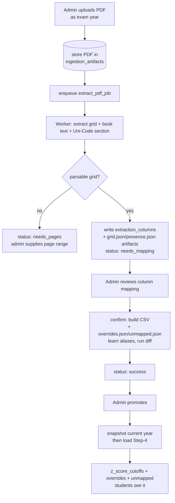
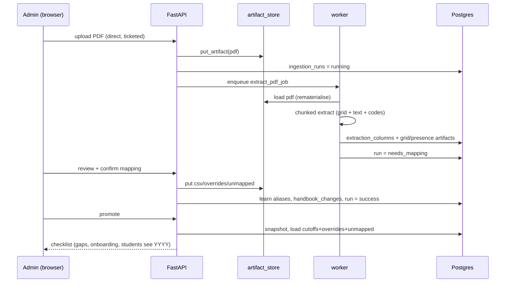

# The Handbook Ingestion Pipeline (PDF → Cutoffs)

## What this is / why it exists

Once a year the UGC publishes a ~200-page handbook whose Section 9 holds the
cutoff grid: hundreds of course columns × 25 district rows of Z-scores, printed
**rotated 90°**. This subsystem turns that PDF into clean rows in
`z_score_cutoffs` — safely, reviewably, and memory-bounded enough to run on a
512 MB worker. It is the hardest subsystem in the platform and the source of
most of the war stories in `16-design-decisions.md`.

The pipeline is **staged and human-gated**: extraction is automatic, but a real
admin reviews the column→course mapping and explicitly promotes before anything
goes live. Nothing an AI or a heuristic decides reaches a student without an
admin's confirmation.

---

## Files in this subsystem

| File | Responsibility |
| --- | --- |
| `apps/api/routers/admin_ingestions.py` | The HTTP lifecycle: upload, list/get runs, re-extract, mapping review + confirm, promote, and the Phase-7 snapshot/archive/checklist. |
| `apps/worker/jobs/extract_pdf.py` | The async extraction job: rematerialise the PDF, run the CPU-bound extractor in a thread, persist columns + artifacts, park the run at `needs_mapping`/`needs_pages`/`failed`. |
| `apps/worker/jobs/ingest_zscores.py` | The Step-4 loader (CSV → `z_score_cutoffs`) plus `apply_stream_overrides` and `apply_unmapped_cutoffs`, and `cutoff_coverage_gaps`. |
| `core/ingestion/grid_extractor.py` | The format-agnostic grid extractor: find cutoff pages, read the rotated grid, consolidate page-spread repeats into logical columns. |
| `core/ingestion/unicode_section.py` | Parse the book's own "Uni-Codes Assigned…" section — the authoritative (course, university) → code table. |
| `core/ingestion/book_search.py` | Build the whole-book text index (the `course_removed` safeguard). |
| `core/ingestion/pdf_pages.py` | `iter_pages_chunked` — memory-bounded chunked page iteration (the OOM fix). |
| `core/ingestion/artifact_store.py` | Cross-instance artifact store (write-through to Postgres). |
| `core/ingestion/column_mapper.py` | Deterministic mapping suggestions (book section + aliases + name similarity). |
| `core/ingestion/stream_tags.py` | Resolve which streams a "- A/- B" variant column represents. |
| `core/ingestion/handbook_diff.py` | Compute the change-set (added/removed/cutoff-changed) with the whole-book presence safeguard. |

> **Jargon.** *arq job* = a function the background worker runs off a Redis
> queue. *Logical column* = one real course column after collapsing the copies a
> book prints across a two-page spread. *Uni-Code* = the UGC course code (e.g.
> `012T`). *NQC* = "No Qualified Candidates" — an empty cutoff cell.

---

## The staged lifecycle

### Stage 1 — Upload (`create_ingestion` in `admin_ingestions.py`)

The admin uploads the handbook PDF **under the exam year** (file year − 1). The
API validates the `%PDF` header, stores the bytes **through the artifact store**
(`put_artifact(db, run_id, "pdf", content)` — DB row + local cache), creates an
`ingestion_runs` row (`running`), commits, then enqueues `extract_pdf_job`.
Because handbooks are 6–22 MB and Vercel caps proxied bodies at 4.5 MB, the
browser uploads **directly to the API** via a short-lived ticket (see
`13-auth-security.md`).

### Stage 2 — Extraction (`extract_pdf_job`, the worker)

Runs on the **worker**, a different machine than the API. First it
rematerialises the PDF from the artifact store if the local cache is absent
(`artifact_path(db, run_id, "pdf")`). Then the CPU-bound work runs in a thread
(`asyncio.to_thread(_extract_and_index, …)`), which does three sweeps:

1. **`extract_grid`** — auto-detect the cutoff pages, read the rotated district
   grid per page, and `consolidate` page-spread repeats into **logical columns**
   (matching labels/codes to columns by nearest-y).
2. **`build_book_text`** — the whole-book text, used to check which active
   courses are present anywhere in the book (the `course_removed` safeguard).
3. **`parse_unicode_section`** — the book's own Uni-Code table, the authoritative
   name→code source (essential for 2025-style books that print no codes in the
   cutoff grid).

It then computes deterministic mapping **suggestions** (`suggest_mappings`),
writes one `extraction_columns` row per logical column (pre-filling exact hits),
stores the `grid.json` and `presence.json` **artifacts**, and parks the run at
`needs_mapping`. If nothing parsable is found it parks at `needs_pages` (admin
supplies a page range and re-extracts); a hard error → `failed`.

**The memory story.** Each sweep touched all ~200 pages in one open handle, and
pdfminer accumulates per-page memory that `flush_cache()` doesn't release —
peaking at **1.25 GB** and OOM-killing the worker. `iter_pages_chunked`
(`pdf_pages.py`) reads in **40-page chunks, closing and reopening** the handle,
dropping the peak to **307 MB** with byte-identical output. See
`16-design-decisions.md` §2.1. And a pathologically slow book is fixed by
**normalising the file with pikepdf** before upload, not by changing this code
(§2.3).

### Stage 3 — Mapping review + confirm (`admin_ingestions.py`)

The admin sees every extracted column with its suggested course, and confirms,
ignores, or tags each. Special cases handled here:

- **Stream splits** — a "- A/- B" pair under one course (e.g. Management Studies
  TV) is tagged with disjoint stream codes (`stream_tags.py`), so the "- B"
  column's numbers go to `course_stream_cutoff_overrides`, not a duplicate row.
- **Codeless columns** — real z-scores with no Uni-Code are **kept without a
  code**; they land in `unmapped_cutoffs` (keyed by printed label).

`confirm_mapping` then: builds the Step-4 **CSV** (one column per course code),
writes the `overrides.json` / `unmapped.json` artifacts, **learns aliases**
(printed label → confirmed code, stored in `course_aliases` so next year
resolves automatically), and runs the **diff** (`compute_handbook_diff`) with the
whole-book presence set to produce the `handbook_changes` change-set. The run
becomes `success`.

### Stage 4 — Promote (`promote_ingestion`)

Promotion is what actually goes live. It:

1. **Snapshots** the year's current data first (`snapshot_year_data`) — a
   pre-promote safety dump to the archive *and* the artifact store, so a promote
   is reversible in one step.
2. Runs the **Step-4 loader** (`ingest_zscores`) on the CSV → `z_score_cutoffs`,
   then `apply_stream_overrides` (→ `course_stream_cutoff_overrides`) and
   `apply_unmapped_cutoffs` (→ `unmapped_cutoffs`).
3. **Archives** the run's artifacts (raw PDF, final CSV, overrides/unmapped) to
   permanent per-year retention.
4. Builds the **post-promote checklist**: coverage gaps, stream-override count,
   codeless count, "students now see YYYY", and (Phase 8.3) "new courses: X of Y
   onboarded".

---

## The cross-instance artifact store

Because the API and worker are **separate machines with separate ephemeral
disks**, every stage output (`pdf`, `grid.json`, `presence.json`, `csv`,
`overrides.json`, `unmapped.json`, `snapshot_*.csv`) is written *through* to the
`ingestion_artifacts` table and rematerialised on whichever instance needs it
next (`core/ingestion/artifact_store.py`). The local work-dir file is only a
cache. Without this, a PDF uploaded to the API could never be read by the worker
(see `12-infrastructure-deployment.md`).

---

## The safeguards

- **Coverage gaps** (`cutoff_coverage_gaps`) — active courses with no cutoff for
  a year, surfaced on the checklist and pinned per-year in tests. The tripwire
  that caught the historical 007K→006K misread.
- **Whole-book presence** — a course is only flagged `course_removed` when it is
  absent from the *entire* book text, not merely the grid pages — so a course
  printed elsewhere isn't falsely marked removed.
- **`course_removed` ≠ delete** — applying it *deactivates* a course; it is never
  dropped. And "absent from this book" is not "not a real course" (the 140P
  saga, §2.9).
- **Pre-promote snapshot** — every promote is reversible because the year's prior
  state is dumped first.

---

## Key design decisions & gotchas

- **Format-agnostic by design.** The extractor never assumes how columns are
  labelled — 2024-style books put codes in rotated headers; 2025-style books
  print `NAME (University)` labels with no codes. The book's own Uni-Code section
  is the bridge.
- **Human-gated promotion.** Extraction and suggestions are automatic;
  activation is a deliberate admin action with a reviewable diff.
- **Everything durable goes in the DB.** On ephemeral split infra, files that
  must survive a deploy or cross a machine live in `ingestion_artifacts`.
- **Fix the file, not the flow.** A bad PDF encoder is handled by normalising the
  file (pikepdf), keeping the battle-tested pipeline untouched.

---

## Related docs

- `03-data-model.md` — the ingestion + cutoff tables.
- `12-infrastructure-deployment.md` — the artifact store, the job timeout, the direct upload.
- `16-design-decisions.md` — the OOM, timeout, normalisation, and duplicate-year war stories.
- `10-admin-frontend.md` — the mapping-review and change-set-review UI.
