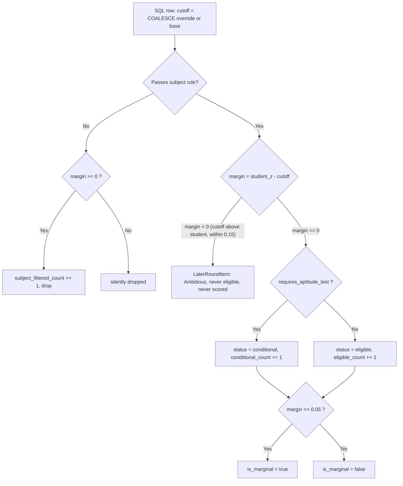
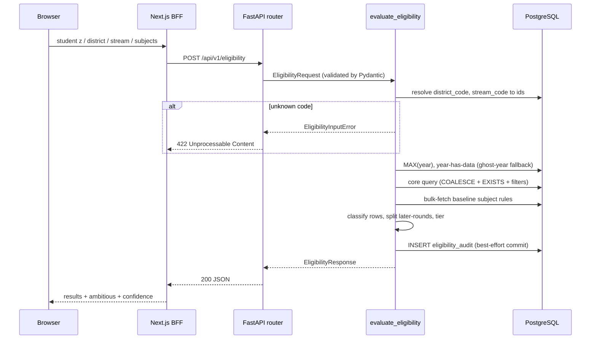
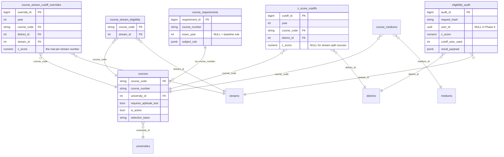

# The Eligibility Engine

## What this is / why it exists

The eligibility engine answers the single most consequential question this
platform can be asked: **given a student's Z-score, district, A/L stream, and
three subjects, which university courses can they actually get into?** Every
downstream feature — the ranked recommendations, the "Ambitious" tab, the chat
advisor — is built on top of the set of courses this engine returns. Because a
wrong answer here can send a real student to fill in the wrong university
application, the engine is **deterministic and never touches an LLM** (large
language model — an AI text model like Gemini; masterplan v4 §8.4). The verdict
is produced by one carefully-bounded SQL query plus a small amount of pure
Python classification, and every query is logged for forensic review.

The engine lives in `core/eligibility/engine.py` and is exposed over HTTP by
`apps/api/routers/eligibility.py` (`POST /api/v1/eligibility`). It is also
called internally by the recommendation service
(`core/scoring/service.py`) as step one of ranking.

---

## Files in this subsystem

| File | Responsibility |
| --- | --- |
| `core/eligibility/engine.py` | The engine itself: the core §8.1 SQL query, three-state classification, marginal flag, confidence tiering, ghost-year fallback, later-rounds window, and audit logging. |
| `core/schemas/eligibility.py` | Pydantic request/response contract for `POST /api/v1/eligibility` (`EligibilityRequest`, `EligibilityResultItem`, `LaterRoundItem`, `EligibilityResponse`). No DB access. |
| `apps/api/routers/eligibility.py` | Thin FastAPI HTTP layer; maps an unknown district/stream code to HTTP 422. |
| `apps/api/routers/recommendations.py` | Sibling router for `POST /api/v1/recommendations`; delegates to the scoring service, which runs this engine first. |
| `core/eligibility/subject_requirements.py` | Pure-Python evaluator for the JSONB subject-rule tree (handbook §2.2) — the generic subject-combination checker. |
| `core/eligibility/arts_basket.py` | Dedicated checker for Arts (course_number `019`), whose 4-basket selection system is unlike anything else in the handbook. |
| `core/models/course_requirements.py` | ORM model for `course_requirements`: one baseline (`exam_year IS NULL`) subject-rule tree per course-of-study number. |
| `core/models/eligibility.py` | ORM models `EligibilityAudit` (one row per query) and `CourseMedium`. |
| `core/models/cutoffs.py` | ORM for `z_score_cutoffs` and `course_stream_cutoff_overrides` — the two tables the COALESCE resolves between. |
| `core/models/course_eligibility.py` | ORM for `course_stream_eligibility` — the stream ALLOW-list the `EXISTS` gate checks. |
| `core/models/course.py`, `core/models/reference.py` | ORM for `courses`, `universities`, `districts`, `streams`, `mediums` — the reference tables the query joins. |
| `core/config.py` | Holds the two tunable knobs: `later_round_z_margin` (0.15) and, indirectly via the code, `MARGINAL_THRESHOLD` (0.05, defined in the engine). |

> **Jargon note (used throughout).** *ORM* = Object-Relational Mapper: Python
> classes (SQLAlchemy `Base` subclasses) that mirror database tables so code can
> talk about rows as objects. *Pydantic* = the library that validates and
> serialises the JSON request/response bodies. *FastAPI router* = the object
> that binds a URL path to a Python handler function. *BFF* = Backend-For-
> Frontend: the Next.js web server that sits between the browser and this
> FastAPI service and proxies most calls (see `12-infrastructure-deployment.md`).

---

## How it works

The public entry point is `evaluate_eligibility(session, req)` in
`core/eligibility/engine.py:210`. It runs in the order below. Everything is
`async` because the app uses `asyncpg` (an asynchronous PostgreSQL driver) so a
single worker can handle many concurrent requests.

### Step 0 — The request contract

A caller sends `EligibilityRequest` (`core/schemas/eligibility.py:40`):

```jsonc
{
  "z_score": 2.37,          // float, validated to the range [-2.0, 4.0]
  "district_code": "COLOMBO",   // human code, not an internal id
  "stream_code": "BIO_SCIENCE", // human code, not an internal id
  "exam_year": 2023,        // optional; defaults to the freshest loaded year
  "subjects": [             // EXACTLY 3 subjects + grades, always required
    {"subject": "Biology",   "grade": "A"},
    {"subject": "Chemistry", "grade": "A"},
    {"subject": "Physics",   "grade": "A"}
  ]
}
```

Notable contract decisions, all enforced by Pydantic before the engine sees the
request:

- **`z_score` range is `[-2.0, 4.0]`.** Handbook cutoffs sit in roughly
  `[-0.7, 2.9]`, but a student's own standardised score can legitimately exceed
  3 (the user-confirmed real maximum is 4.0). The validator rejects anything
  outside the band with a 422 automatically.
- **Codes, not ids.** The request speaks `district_code='COLOMBO'` and
  `stream_code='BIO_SCIENCE'`, never the internal integer `district_id` /
  `stream_id`. A `field_validator` upper-cases and trims them so `colombo`
  still resolves. The engine translates codes → ids and raises
  `EligibilityInputError` (→ HTTP 422) for an unknown code.
- **Exactly three subjects are mandatory.** Many courses gate on the *exact*
  subject combination beyond the stream — Engineering (course_number `008`)
  requires Chemistry specifically, so a Physics + Combined Maths + ICT student
  in the Physical Science stream does **not** qualify even though the stream is
  right. Grades are one of `F/S/C/B/A` (Fail / ordinary paSs / Credit / B / A).

### Step 1 — Resolve codes to ids

```python
district_id = await _resolve_district_id(session, req.district_code)  # SELECT ... FROM districts WHERE code = :code
stream_id   = await _resolve_stream_id(session, req.stream_code)      # SELECT ... FROM streams   WHERE code = :code
```

Each is a one-row lookup; a miss raises `EligibilityInputError`, which the
router turns into `422 Unprocessable Content`. This is deliberately a *client*
error, not a 500 — the request was well-formed JSON but named something that
doesn't exist.

### Step 2 — Decide which year to actually serve (the ghost-year fallback)

This is one of the subtlest and most important pieces of the engine. See
`engine.py:219-240`.

```python
max_year  = await _get_max_year(session)          # MAX(year) FROM z_score_cutoffs
used_year = req.exam_year if req.exam_year is not None else max_year
fallback_note = None
if (req.exam_year is not None
        and max_year is not None
        and req.exam_year != max_year
        and not await _year_has_data(session, req.exam_year)):
    used_year = max_year
    fallback_note = (
        f"Cutoffs for {req.exam_year} aren't published on this platform; "
        f"showing the latest available year ({max_year}) instead.")
if used_year is None:                              # z_score_cutoffs is empty
    used_year = req.exam_year or 0
```

The rules, in plain English:

1. **No year requested** → serve the freshest year we have (`max_year`). Today,
   with only 2023 loaded, that is 2023.
2. **A year is requested and it has promoted data** → honour it exactly.
3. **A year is requested but it has NO rows** → do **not** return a
   "verified 2099" result that is silently empty. Instead fall back to
   `max_year` and attach an honest `fallback_note` explaining the substitution.
4. **The whole table is empty** (degenerate/first-boot) → `used_year` becomes
   `req.exam_year or 0`; the core query then simply returns nothing. An honest
   empty result, never a crash.

**Why this exists.** A student's browser can cache a `exam_year` value that an
admin later re-labels or removes (this actually happened in production on
2026-07-12). Without the fallback, that stale year would produce a confident-
looking but empty answer — the worst possible failure for a tool a real student
trusts. The regression fixtures pin this: `missing_year_future` (2099) and
`missing_year_past` (2019) both assert `expect_fallback: true`
(`tests/fixtures/eligibility_cases.yaml:126-143`), and
`test_requested_year_without_data_falls_back_to_latest` asserts the served year
is `max_year`, the result is non-empty, and the message names both years.

### Step 3 — The core SQL query (the correctness-critical heart)

The verbatim §8.1 query is `_CORE_QUERY` at `engine.py:70-113`. It is executed
once, with bound parameters (never string-interpolated — that would be an SQL
injection hole), and it is the *only* place the eligible set is computed:

```sql
SELECT
  zc.cutoff_id,
  zc.year,
  COALESCE(so.z_score, zc.z_score) AS cutoff_z_score,   -- (A) per-stream override
  c.course_code,
  c.course_number,
  c.name_en                        AS course_name,
  c.duration_years,
  c.selection_basis,
  c.requires_aptitude_test,
  u.code                           AS university_code,
  u.name_en                        AS university_name,
  u.district_id                    AS university_district_id,
  ARRAY(                                                  -- (D) available mediums
    SELECT m.code FROM course_mediums cm
    JOIN mediums m ON m.medium_id = cm.medium_id
    WHERE cm.course_code = c.course_code
  )                                AS available_mediums
FROM z_score_cutoffs zc
JOIN courses      c ON c.course_code   = zc.course_code
JOIN universities u ON u.university_id = c.university_id
LEFT JOIN course_stream_cutoff_overrides so              -- (A) LEFT JOIN, keyed by student's stream
  ON  so.course_code  = zc.course_code
  AND so.district_id  = zc.district_id
  AND so.year         = zc.year
  AND so.stream_id    = :student_stream_id
WHERE zc.year         = :exam_year                       -- (B) year filter
  AND zc.district_id  = :district_id                     -- (B) district filter
  AND COALESCE(so.z_score, zc.z_score) IS NOT NULL        -- (C) drop NQC / no-cutoff rows
  AND COALESCE(so.z_score, zc.z_score) <= :z_ceiling      -- (C) student z + later-round margin
  AND c.is_active     = TRUE
  AND EXISTS (                                            -- (E) stream ALLOW-list gate
    SELECT 1 FROM course_stream_eligibility cse
    WHERE cse.course_code = c.course_code
      AND cse.stream_id   = :student_stream_id
  )
ORDER BY cutoff_z_score DESC
```

The four bound parameters:

| Param | Value | Source |
| --- | --- | --- |
| `:exam_year` | the `used_year` from Step 2 | resolved above |
| `:district_id` | resolved district id | Step 1 |
| `:student_stream_id` | resolved stream id | Step 1 |
| `:z_ceiling` | `Decimal(str(z_score)) + Decimal(str(later_round_z_margin))` | request + `settings.later_round_z_margin` (0.15) |

Walking the labelled clauses:

**(A) The `COALESCE` over the per-stream override.** `COALESCE(a, b)` is SQL for
"use `a` if it isn't NULL, otherwise `b`." Almost every course prints one
official Uni-Code with one cutoff per district, stored in `z_score_cutoffs`. A
tiny number of courses genuinely print *different* cutoffs per A/L stream under
that single Uni-Code — the one verified real case across the 2023/2024/2025
handbooks is **Food Business Management, `107L`, Sabaragamuwa**. For such a
course the base `z_score_cutoffs.z_score` is left `NULL` and the real numbers
live in `course_stream_cutoff_overrides`, one row per stream. The `LEFT JOIN`
is keyed by the student's own `:student_stream_id`, so `COALESCE(so.z_score,
zc.z_score)` picks the override number *for this student's stream* when one
exists, and transparently falls back to the general row (a `LEFT JOIN`
non-match yields `so.z_score = NULL`) for the other 260+ courses. The join is
provably a no-op for ordinary courses — that is exactly what
`test_ordinary_course_unaffected_by_override_join` asserts, and
`test_override_picks_correct_cutoff_per_stream` proves a Commerce student sees
the Commerce cutoff (1.20) while a Bio-Science student sees the Bio/Physical one
(0.50) for the same `107L`.

**(B) District + year filters.** The two equality filters that scope the query
to one district's cutoff table for one exam year. The partial index
`idx_zscore_district_lookup (year, district_id, z_score) WHERE z_score IS NOT
NULL` (declared on the ORM model in `core/models/cutoffs.py:44`) is the intended
hot path for this lookup.

**(C) The Z-score ceiling — and why it's a ceiling, not a floor.** Notice the
query does **not** filter `cutoff <= student_z`. It filters
`cutoff <= student_z + 0.15`. It deliberately over-fetches a thin band of
courses whose cutoff sits *above* the student, so the Python layer can split
them into the "later selection rounds" list (Step 5). The
`COALESCE(...) IS NOT NULL` clause drops rows with no usable number — an
`NQC` ("no qualified candidates" / no cutoff published) row, or a stream-split
base row for a stream that has no override.

**(D) `available_mediums`** is a correlated subquery that gathers the medium
codes (`SI`/`TA`/`EN`) a course is taught in, as a Postgres array. `course_mediums`
is empty until Phase 9, so today this comes back as `[]`.

**(E) The `EXISTS` stream gate.** `EXISTS (SELECT 1 ...)` is SQL for "return
true if at least one matching row exists." `course_stream_eligibility` is the
ALLOW-list of `(course_code, stream_id)` pairs — which streams may even apply
for a course. This gate is what makes a Commerce student's request for Medicine
(`001A`, a Bio-Science course) return nothing: the fixture case
`stream_mismatch_001A` (z=3.0, COLOMBO, COMMERCE) asserts `001A` is excluded.

Two implementation details worth internalising:

- **`Decimal(str(...))` for `:z_ceiling`.** The cutoff column is
  `NUMERIC(6,4)` — an exact decimal. Passing a raw Python `float` risks binary
  floating-point drift (e.g. `2.37` stored as `2.3699999...`), which would flip
  an exact-at-cutoff case. Building the parameter as
  `Decimal(str(req.z_score)) + Decimal(str(settings.later_round_z_margin))`
  keeps the comparison exact. The fixtures probe this to four decimals:
  `exact_001A_colombo` (z=2.37 → eligible) vs `below_001A_colombo`
  (z=2.3699 → excluded).
- **`ORDER BY cutoff_z_score DESC`** returns rows highest-cutoff first, so the
  eventual `results` list is already in "hardest course first" order without a
  Python re-sort.

### Step 4 — Fetch subject rules in bulk, then classify each row

Rows come back and the engine loads student subjects and, in one query, the
baseline subject rules for every distinct `course_number` in the result set
(`_fetch_subject_rules`, `engine.py:140`). Doing this as a single
`course_number = ANY(:numbers) AND exam_year IS NULL` query avoids an N+1 (one
extra query per row). `exam_year IS NULL` selects the **baseline** rule — the
rule that applies to every year unless a year-specific override row is later
added (see `course_requirements` in `core/models/course_requirements.py`).

Then the engine loops over the SQL rows (`engine.py:264`) and for each computes:

```python
cutoff = float(r["cutoff_z_score"])
margin = round(req.z_score - cutoff, 4)   # student z MINUS cutoff
```

and applies three checks in this exact order:

1. **Subject requirement** (`_passes_subject_requirement`, `engine.py:159`):
   - `course_number == "019"` (Arts) → delegate to `check_arts_eligibility`.
   - Otherwise look up the rule; **no rule found ⇒ pass** (ungated by design —
     curation is incremental so an un-curated course never silently disappears).
   - Otherwise evaluate the JSONB rule tree against the student's subjects.
   If the course **fails** subjects, it is dropped from `results`. It only
   increments `subject_filtered_count` when `margin >= 0` — i.e. the student
   cleared the Z-score and stream but lost purely on subjects (the count keeps
   its historical meaning: "courses you were good enough for but for your
   subject mix"). A near-miss course they also can't take on subjects is
   silently dropped.

2. **The later-rounds window** (`margin < 0`): the course's cutoff is above the
   student's Z but within `+0.15`. It is appended to the `later_round` list as a
   `LaterRoundItem` and `continue`d — **never counted as eligible, never
   scored** (Step 5).

3. **Eligible vs conditional** (`margin >= 0`):

   ```python
   conditional = bool(r["requires_aptitude_test"])
   status = "conditional" if conditional else "eligible"
   is_marginal = margin <= MARGINAL_THRESHOLD   # 0.05
   ```

### The three states

| State | Condition | Where it appears |
| --- | --- | --- |
| **eligible** | `margin >= 0` **and** `requires_aptitude_test = FALSE` | `results[]`, `status="eligible"`, counts toward `eligible_count` |
| **conditional** | `margin >= 0` **and** `requires_aptitude_test = TRUE` | `results[]`, `status="conditional"`, counts toward `conditional_count` |
| **not_eligible** | `margin < 0` (below cutoff), or stream mismatch, or subject-rule failure | **never returned** — filtered by the SQL or the Python loop |

Two things to notice. First, **`not_eligible` is not a status literal** — the
`status` field is `Literal["eligible", "conditional"]` only. "Not eligible"
manifests as *absence* from `results`. A student below every cutoff simply gets
an empty `results` list (plus, possibly, a `later_round` list). Second,
**conditional literally means "requires an aptitude test."** Courses marked with
the handbook's `#` aptitude-test marker (set on `courses.requires_aptitude_test`
by migration 10) — for example Architecture (`023`), Landscape Architecture
(`097`), Film & Television Studies (`100`) — come back as `conditional`: the
student clears the Z-score and stream, but admission still depends on passing a
separate practical/aptitude test the engine cannot evaluate.

### The marginal flag

`is_marginal = margin <= 0.05` (`MARGINAL_THRESHOLD`, `engine.py:50`). Because
every returned course already has `margin >= 0`, `is_marginal` effectively means
`0 <= margin <= 0.05`: the student cleared the cutoff, but by a hair. The flag
exists because cutoffs move year to year — a course cleared by 0.02 this year
could flip to out-of-reach next year, and the UI warns the student accordingly.
Fixture `exact_001A_colombo` (z exactly at the 2.37 cutoff, margin 0.0) pins
`is_marginal: true`.

### Step 5 — The later-selection-rounds window ("Ambitious")

Courses whose cutoff sits in `(student_z, student_z + 0.15]` are **not**
eligibility — they are surfaced separately as `LaterRoundItem`s
(`core/schemas/eligibility.py:114`). The rationale, straight from the code:
in past admission cycles, seats vacated after the UGC's first selection round
have admitted near-miss students in later rounds, so a student who is 0.05 short
of their dream course should know it isn't necessarily over. Critical
properties:

- **Subject rules and the stream gate still apply.** A course the student could
  *never* take (wrong stream, wrong subjects) is never shown, even here.
- **It carries `gap_above = cutoff − student_z`** (always > 0) instead of a
  margin.
- **It is never scored and never counted as eligible.** The recommendation
  service passes it through untouched (`core/scoring/service.py:507-510`).
- It is sorted highest-cutoff-first: `sorted(later_round, key=lambda i:
  (-i.cutoff_z_score, i.course_code))` (`engine.py:343`).

The width of this window is `settings.later_round_z_margin` (default `0.15`,
`core/config.py:61`) and is echoed back to the client as `later_round_margin`
so the UI can state the exact band it used.

### Step 6 — Confidence tiering

`_confidence(max_year, used_year)` (`engine.py:194`) classifies how stale the
served year is, by comparing it to the freshest year in the table:

| Tier | Gap (`max_year − used_year`) | Message |
| --- | --- | --- |
| `current` | `<= 0` | none |
| `previous_year` | `1` | "Based on last year's cutoffs; this year's may differ." |
| `estimated` | `>= 2` | "Based on cutoffs from {used_year}; the most recent data is {gap} years newer and may differ." |

With only 2023 loaded, every response is `current`. If a ghost-year fallback
fired in Step 2, its `fallback_note` is prepended to whatever the tier message
would have been (`engine.py:324`). Note the interaction: a requested *past*
year with no data falls back to `max_year`, so its tier is `current` (we are
serving the freshest year) *plus* the fallback note — the tier describes the
year actually served, not the year requested.

### Step 7 — Assemble the response and log the audit

The engine builds an `EligibilityResponse` (`core/schemas/eligibility.py:137`)
carrying the served year, tier + message, the echoed inputs, the four counts
(`eligible_count`, `conditional_count`, `total_count`, `subject_filtered_count`),
the ordered `results`, and the later-rounds block. Then it writes exactly one
`eligibility_audit` row (Step 8) and returns.

### Step 8 — The audit log (`_write_audit`, `engine.py:352`)

```python
raw = f"{req.z_score}|{district_id}|{stream_id}|{used_year}"
request_hash = hashlib.sha256(raw.encode("utf-8")).hexdigest()
audit = EligibilityAudit(
    request_hash=request_hash,
    user_id=None,                       # no auth in Phase 6 -> always NULL
    z_score=req.z_score, district_id=district_id, stream_id=stream_id,
    cutoff_year_used=used_year,
    eligible_count=response.eligible_count,
    conditional_count=response.conditional_count,
    confidence_tier=response.confidence_tier,
    result_payload=response.model_dump(mode="json"),
    latency_ms=latency_ms,
)
try:
    session.add(audit); await session.commit()
except Exception:
    await session.rollback()
    logger.warning("Failed to write eligibility_audit row", exc_info=True)
```

Every query persists one row for later forensic investigation (masterplan v4
§5.1). Key design points:

- **Hash-keyed.** `request_hash` is `sha256("z|district_id|stream_id|used_year")`.
  It lets you group identical *core* queries together, and there is an index
  `idx_eligibility_audit_hash` on it (`core/models/eligibility.py:63`). Note
  the hash intentionally does **not** include subjects — two students with the
  same Z-score, district, stream, and year share a hash even if their subject
  mixes differ; the full inputs and output still live in the row's own columns
  and `result_payload`.
- **`user_id` is always NULL in Phase 6** (no auth yet). The foreign key to
  `users(user_id)` is deferred to the Phase 8 migration that creates that table
  (`core/models/eligibility.py:9-14`).
- **Logging is best-effort and must never deny a result.** The write is wrapped
  in `try/except`; a failure rolls back and logs a warning, but the caller still
  gets their eligibility answer. This is the *only* write in an otherwise
  read-only request — the `commit()` here is what flushes it.

---

## Diagrams

### Decision path for a single cutoff row



### Request flow (HTTP to verdict)



### Tables the core query touches



---

## The subject-requirement layer in detail

### The generic JSONB rule tree

`course_requirements.subject_rule` is a small boolean-condition tree stored as
JSONB (Postgres's binary JSON column type) and evaluated by
`evaluate_subject_rule` (`core/eligibility/subject_requirements.py:52`). The
leaf and combinator node types:

| `type` | Meaning |
| --- | --- |
| `subject_min_grade` | one named subject at ≥ a minimum grade |
| `one_of_min_grade` | at least one subject from a list at ≥ a minimum grade |
| `count_from_list` | at least N subjects from a list, each at ≥ a minimum grade |
| `any_n_subjects` | at least N passing subjects, no subject constraint |
| `stream_is` | true iff the student's stream is in a given list |
| `and` / `or` | combinators over child conditions |

Grades are ranked `F=0, S=1, C=2, B=3, A=4` (`GRADE_RANK`), and
`_meets_min_grade` compares ranks. A real example — **Engineering
(course_number `008`)**, the user-confirmed anchor
(`data/seeds/course_requirements_data.py:274`):

```json
{"type": "and", "conditions": [
  {"type": "subject_min_grade", "subject": "Chemistry",          "min_grade": "S"},
  {"type": "subject_min_grade", "subject": "Combined Mathematics","min_grade": "S"},
  {"type": "subject_min_grade", "subject": "Physics",            "min_grade": "S"}
]}
```

This is why a Physical-Science student without Chemistry is filtered out of
Engineering even though their stream is eligible — the `EXISTS` gate passes but
the subject rule fails, and (because `margin >= 0`) it increments
`subject_filtered_count`.

The `stream_is` node handles the handful of rules that genuinely differ *by*
stream. **Tourism & Hospitality Management (course_number `092`)** is the model
case (`course_requirements_data.py:590`): Commerce / Bio-Science / Physical-
Science students need any 3 passes, while Arts-stream students need a specific
anchor subject (Economics, Geography, or Business Statistics). Note the division
of labour: whether a stream may apply *at all* is `course_stream_eligibility`'s
job (the `EXISTS` gate); `stream_is` only expresses a subject rule that is
*conditional on* the stream.

**The incremental-curation principle.** A `course_number` with no row in
`course_requirements` is **ungated** — `_passes_subject_requirement` returns
`True` when no rule is found. This lets the team curate the ~130 subject rules
from the handbook over time without ever breaking existing behaviour: an
un-curated course is stream-and-Z-checked only, never wrongly excluded. This is
verified by the reference-oracle test (`test_eligibility_engine.py`), which
applies the identical "no rule ⇒ pass" logic on its independent code path.

### The Arts basket special case (course_number `019`)

Arts is Sri Lanka's single largest-intake course of study (6,983 seats) and uses
a **4-basket** selection system unlike anything else in the handbook. It is
deliberately **not** forced into the generic tree — a forced-fit risks getting
the country's biggest course subtly wrong — so it has its own dedicated checker,
`check_arts_eligibility` (`core/eligibility/arts_basket.py:78`), branched to by
`_passes_subject_requirement` when `course_number == "019"`
(`ARTS_COURSE_NUMBER`, `engine.py:45`). The rule, transcribed from handbook
§2.2.1.1:

- Exactly 3 subjects, each at ≥ S grade.
- At least 1 subject from **Basket 01** (Economics, Geography, History, Maths,
  ICT, the technology subjects, …), **unless** one of three explicit exceptions
  applies (three national languages; a national + classical language mix; or two
  Basket-04 languages plus one Basket-02/03 subject).
- **Basket 02** (Religions + Civilizations): at most 2, and a religion may not be
  paired with its own civilization (e.g. Buddhism + Buddhist Civilization).
- **Basket 03** (Aesthetic: Art / Dancing / Music / Drama & Theatre): at most 2,
  and not two from the same aesthetic area.
- **Basket 04** (Languages: National / Classical / Foreign): at most 2, with the
  national/classical exemptions; never 3 classical or 3 foreign languages.

Subjects outside all four baskets are simply not counted toward any basket. The
dedicated suite `tests/unit/test_arts_basket.py` exercises this checker in
isolation.

---

## How the recommendation service builds on the engine

`POST /api/v1/recommendations` (`apps/api/routers/recommendations.py`) is a
sibling endpoint that *starts* from this engine. `recommend()` in
`core/scoring/service.py:371` calls `evaluate_eligibility` first, then:

1. **Scores only `elig.results`** (the eligible/conditional set) with the active
   deterministic scoring config — the later-rounds list is passed through
   **unscored** (`service.py:507-510`). Eligibility and desirability are kept
   strictly separate.
2. **Interest matching via pgvector** (`_interest_scores`, `service.py:268`).
   *pgvector* is a Postgres extension for storing and comparing *embeddings* —
   numeric vectors that capture the meaning of text. The student's free-text
   interests are embedded by Gemini and compared (cosine similarity) against
   course document chunks. This is the *only* Gemini dependency in the
   recommendation path, and it is guarded by a daily budget: out of budget, the
   dimension goes inert and rankings still work. Eligibility itself never needs
   Gemini.
3. **Adds "also offered" programmes** (`_also_offered`, `service.py:344`): active
   courses the student's stream is eligible for that have **no usable cutoff** in
   their district for the served year — neither a general `z_score_cutoffs` row
   nor a stream-specific override. These are surfaced so nothing silently
   disappears from view.

Because `RecommendationRequest` *extends* `EligibilityRequest`
(`core/schemas/recommendation.py:17`), the same z-score/district/stream/subjects
contract and the same 422 behaviour apply. Both routers catch
`EligibilityInputError` and map it to 422.

---

## Key design decisions & gotchas

- **Determinism is the whole point.** The eligible set is one SQL query plus
  pure-Python classification. No LLM ever touches the verdict (masterplan §8.4 /
  §20 principle #1). The subject checkers (`subject_requirements.py`,
  `arts_basket.py`) are pure functions with no DB and no network. This is what
  makes the result reproducible and auditable.

- **An independent oracle guards the SQL.** `test_eligibility_engine.py` runs a
  *second, independently written* reference query (plain `JOIN` form) for every
  fixture case and asserts the engine matches it course-for-course, including
  cutoff / status / margin / marginal flag. A bug in the engine's
  `EXISTS + ARRAY + COALESCE` form is unlikely to be mirrored in the reference's
  `JOIN` form, so divergence surfaces. Universal invariants are also enforced
  (no NULL cutoff leaks, aptitude ⇒ conditional, cutoff-descending order, count
  arithmetic, tier formula).

- **The over-fetch ceiling is a footgun if you forget it.** The SQL filters
  `cutoff <= z + 0.15`, **not** `cutoff <= z`. If you read only the SQL you might
  think courses above the student are "eligible." They are not — the Python
  `margin < 0` branch diverts them to `later_round`. Never treat a raw core-query
  row as eligible without the Python classification.

- **`NULL` base cutoff is meaningful, not missing data.** For a stream-split
  course like `107L`, `z_score_cutoffs.z_score` is *intentionally* `NULL` and the
  truth lives in `course_stream_cutoff_overrides`. The
  `COALESCE(...) IS NOT NULL` filter is what makes a stream with no override for
  that course correctly disappear, while the COALESCE-in-SELECT makes the split
  cutoff appear for the streams that do have one.

- **Ghost-year fallback over honest emptiness.** A requested year with no data
  is never answered with a confident empty "verified YYYY" result — it silently
  falls back to the freshest year and *says so* in `confidence_message`. This
  was a real production incident (2026-07-12) caused by a stale year cached in a
  student's browser.

- **`Decimal(str(...))` matters at the boundary.** Comparing a Python `float`
  against a `NUMERIC(6,4)` column can drift in the fourth decimal and flip an
  exact-at-cutoff verdict. The `:z_ceiling` parameter is built with `Decimal` on
  purpose. If you add new numeric comparisons against cutoffs, do the same.

- **`subject_filtered_count` has a precise, narrow meaning.** It counts only
  courses the student cleared on stream *and* Z-score but lost on subjects
  (`margin >= 0`). A course they miss on *both* subjects and Z-score is dropped
  silently and is not in this count. Don't read it as "all subject failures."

- **`not_eligible` is an absence, not a value.** There is no `status:
  "not_eligible"`. Consumers must treat "course not in `results`" as
  not-eligible; they cannot filter on a status string for it.

- **The audit `commit()` is the request's only write.** Everything else is a
  read. If you add logic after `_write_audit`, remember the transaction has
  already been committed (or rolled back) by the audit step.

- **The request hash omits subjects by design.** `request_hash` groups by
  `(z, district_id, stream_id, year)` only. Useful for spotting repeated core
  queries, but do not use it as a unique key for a full request — subjects vary
  underneath it.

- **`available_mediums` is empty today.** `course_mediums` is unpopulated until
  Phase 9, so the array subquery returns `[]`. Don't build UI that assumes a
  medium is always present.

---

## Related docs

- `03-data-model.md` — full schema for `z_score_cutoffs`,
  `course_stream_cutoff_overrides`, `course_stream_eligibility`, `courses`,
  `course_requirements`, and the reference tables joined here.
- `04-ingestion-pipeline.md` — how handbook PDFs become `z_score_cutoffs` rows,
  how stream overrides are written (`apply_stream_overrides`), and the
  year-label convention that `exam_year` depends on.
- `06-recommendation-scoring.md` — how the eligible set produced here is scored,
  bucketed (safe / ambitious / hidden / consider), and ordered.
- `12-infrastructure-deployment.md` — the Next.js BFF, CORS, async `asyncpg`
  runtime, and where the FastAPI service and Arq worker run.
