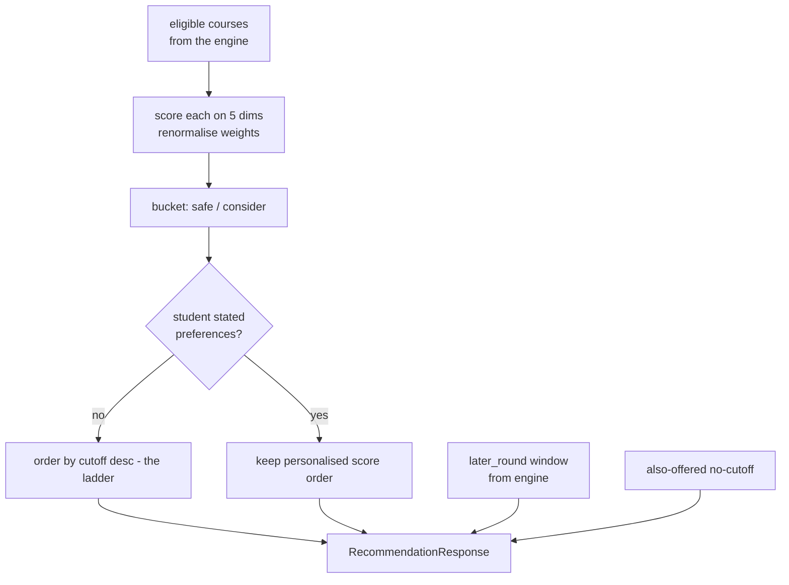

# Scoring & Recommendations

## What this is / why it exists

The eligibility engine (`05-eligibility-engine.md`) returns *which* courses a
student can get into. This subsystem decides *how to present them* — scoring
each on a transparent, weighted, multi-dimension scale, sorting into a sensible
order, and bucketing them into the **Safe / Consider** tabs (with the
**Ambitious** tab coming from the eligibility engine's later-rounds window). The
scorer is **pure Python — no LLM, no I/O** — because a student must be able to
ask "why is Engineering ranked above IT for me?" and get an auditable answer.

---

## Files in this subsystem

| File | Responsibility |
| --- | --- |
| `core/scoring/engine.py` | The pure scorer: five dimension functions, weight renormalisation, `tanh` margin normalisation, `_bucket`, `score_course`, `score_courses` (sorts by total). |
| `core/scoring/service.py` | Orchestrates the whole recommendation: runs eligibility, scores, fetches stream codes, applies the no-preference ladder ordering, computes interest embeddings, builds the also-offered list, assembles `RecommendationResponse`. |
| `core/scoring/config.py` | Loads the active `scoring_config` row (weights + thresholds), with a built-in default. |
| `core/schemas/recommendation.py` | The response contract (`ScoredRecommendation`, `RecommendationResponse`, `DimensionBreakdownItem`, later-round fields). |

---

## The five dimensions

Each eligible course is scored 0–1 on up to five named dimensions, each with a
configurable weight (from `scoring_config`):

| Dimension | Signal | Active when |
| --- | --- | --- |
| `z_margin` | how safely the student's Z clears the cutoff, `tanh`-normalised so huge margins don't dominate | always |
| `university` | bonus if the course is at a stated preferred university | student named preferences |
| `interest` | semantic match between the student's stated interest text and the course (Gemini embeddings) | student wrote interests + budget available |
| `career` | career-goal alignment | interest/career signal present |
| `industry` | job-market outlook for the sector | course carries industry tags (a pure market signal, often active even with no preferences) |

**Weight renormalisation.** Dimensions with no data are inert; the active
weights are renormalised to sum to 1. So a student with *no* preferences still
gets an honest ranking driven by `z_margin` (+ `industry` where present) — "no
preferences → a sensible safety-first list", not a broken one.

> **Jargon.** *`tanh` normalisation*: a math function that squashes `[0, ∞)`
> into `[0, 1)` smoothly, so a margin of 2.0 doesn't score 40× a margin of 0.05.
> *Embedding*: a vector capturing meaning — the interest dimension compares the
> student's interest text to course text by vector similarity (see
> `07-rag-knowledge.md`).

---

## Buckets (as they are now)

`_bucket(total, margin, thresholds)` in `engine.py`, after the 2026-07-13
rework, returns only **two** eligible buckets:

```python
def _bucket(total, margin, th):
    if total >= th["safe_score"] and margin >= th["safe_margin"]:
        return "safe"
    return "consider"
```

- **`safe`** — comfortably above the cutoff (total ≥ 0.6 and margin ≥ 0.10).
- **`consider`** — eligible but with less headroom (everything else eligible,
  including tight clears that used to be "ambitious").

**"Ambitious" is no longer an eligible bucket.** It is the *above-your-score*
later-rounds set produced by the eligibility engine (`later_round`, within
+0.15) — see `05-eligibility-engine.md`. The `scoring_config` thresholds still
carry `ambitious_*` keys for backward compatibility, but `_bucket` ignores them.

---

## Ordering — two modes

`score_courses` sorts by `(-total_score, course_code)`. Then `service.py`
applies the user's 2026-07-13 rule:

- **No-preference (normal) mode** — the student is really asking "what's the
  highest course I can get?" So the recommendations are re-sorted **highest
  cutoff first** (the ladder): `recommendations.sort(key=lambda r: (-r.cutoff_z_score, r.course_code))`.
- **Preference mode** — the personalised `total_score` order stands (their
  stated universities/interests shaped it).

The later-rounds list is also sorted highest-cutoff-first.



---

## The interest embedding path

When a student writes interests and the daily Gemini budget allows, the service
embeds the interest text and compares it to course text to score the `interest`
dimension. When the **budget is exhausted**, this degrades gracefully to inert
(returns `{}`) — the dimension simply drops out and weights renormalise around
it. Eligibility and the core ranking never depend on Gemini, so a budget-out day
still produces good recommendations (see `12-infrastructure-deployment.md` for
the budget guard).

---

## The response shape (`RecommendationResponse`)

| Field | Meaning |
| --- | --- |
| `exam_year_used`, `confidence_tier`, `confidence_message` | which year was served + honesty about its age / fallback |
| `mode` | `preference` or `normal` |
| `eligible_count`, `conditional_count`, `subject_filtered_count` | counts |
| `bucket_counts` | `{safe, consider}` — never contains `ambitious` any more |
| `recommendations[]` | the ranked, bucketed, ordered `ScoredRecommendation`s with per-dimension `breakdown` |
| `later_round_count`, `later_round[]`, `later_round_margin` | the Ambitious tab (above-your-score, +0.15) |
| `also_offered_no_cutoff_count`, `also_offered_no_cutoff[]` | courses in the stream with no cutoff in the district (e.g. 140P) |

---

## Key design decisions & gotchas

- **Deterministic & explainable.** Every course carries its dimension breakdown,
  so the UI can show *why* it's ranked where it is. An LLM-assigned score
  couldn't be trusted to explain itself.
- **Admin-tunable, no redeploy.** Weights + thresholds live in `scoring_config`
  (versioned, one active row); an admin can retune ranking without a code change.
- **Inert-degradation everywhere.** No preferences, or no Gemini budget, both
  degrade to a still-honest `z_margin`-driven list rather than an error.
- **Bucket semantics changed on 2026-07-13.** Old docs/tests that expected an
  `ambitious` eligible bucket were re-pinned; the tab now means "above your
  score", not "barely eligible". If you see `ambitious` in `bucket_counts`, the
  code is stale.

---

## Related docs

- `05-eligibility-engine.md` — produces the eligible list and the later-round window this ranks.
- `11-student-frontend.md` — the three-tab UI that renders these buckets.
- `07-rag-knowledge.md` — the embeddings behind the interest dimension.
- `16-design-decisions.md` §2.5 / §2.9 — the ghost-year and 140P stories that touch this response.
