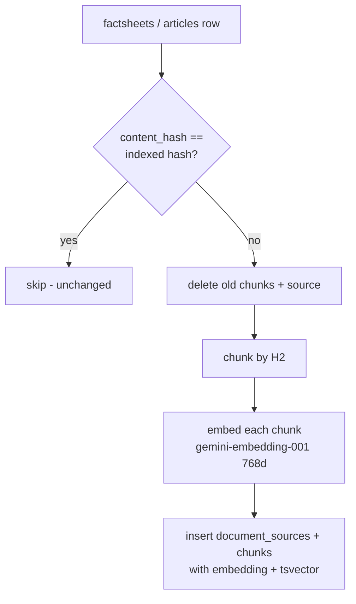
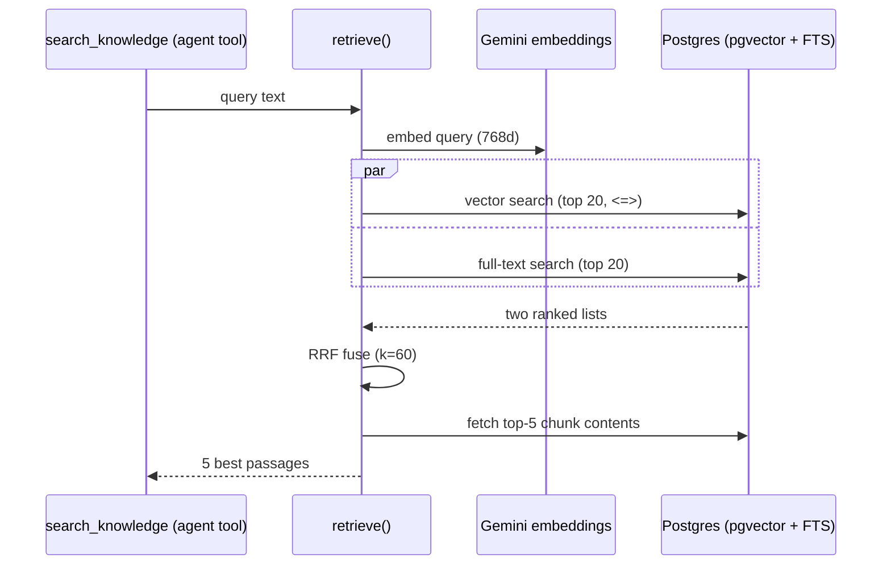

# The RAG Knowledge System (No Framework)

## What this is / why it exists

The AI advisor needs to answer questions about *curriculum, career paths, and
degree comparisons* — knowledge that lives in prose, not in the cutoff tables.
That prose is stored as **factsheets** (one per course-of-study number) and
**articles** (knowledge beyond courses: aptitude tests, scholarships, UGC
procedures). To let the AI *search* that prose by meaning, the platform builds a
**RAG** system — Retrieval-Augmented Generation — entirely by hand: no
LangChain, no LlamaIndex, no external vector database.

> **RAG in one sentence:** instead of hoping the language model memorised a
> fact, you *retrieve* the most relevant passages from your own documents and
> hand them to the model as context, so its answer is grounded in your data.

The retrieval is **hybrid**: semantic (vector) search *plus* keyword (full-text)
search, fused together. This doc explains both the indexing side (documents →
searchable vectors) and the query side (question → best passages).

---

## Files in this subsystem

| File | Responsibility |
| --- | --- |
| `core/rag/retrieval.py` | Query-time hybrid retrieval: embed the query, run pgvector + full-text search in parallel, fuse with Reciprocal Rank Fusion, return the top-k chunks. |
| `apps/worker/jobs/index_factsheets.py` | Index-time job for **factsheets**: chunk markdown by H2, embed each chunk with Gemini, upsert into `document_sources` + `chunks`. Idempotent. |
| `apps/worker/jobs/index_articles.py` | The same machinery for **articles** (Phase 8.6), reusing the factsheet job's chunker/embedder. `remove_article_index` for deletes. |
| `core/models/rag.py` | ORM models: `Factsheet`, `Article` (the editable sources), `DocumentSource` + `Chunk` (the indexed, embedded copy). |
| `apps/api/routers/admin_knowledge.py` | Admin browser over the index + staleness flags + a "reindex stale" trigger. See `09-admin-backend.md`. |

> **Jargon.** *Embedding*: a list of numbers (here 768 of them) that represents
> the *meaning* of a piece of text, such that similar meanings have nearby
> vectors. *pgvector*: a PostgreSQL extension that stores those vectors and
> computes distances between them. *Chunk*: a small passage of a document (here
> one H2 section) — you retrieve chunks, not whole documents.

---

## Index time — documents become searchable vectors

### The two source tables vs the indexed tables

There is a deliberate split between what an admin *edits* and what the AI
*searches*:

- **`factsheets`** (`course_number` PK) and **`articles`** (`article_id` PK) —
  the editable source of truth, each with `content`, `version`, and a
  `content_hash`.
- **`document_sources`** + **`chunks`** — the indexed copy the retriever reads:
  one `document_sources` row per source, many `chunks` rows (each with an
  `embedding vector(768)` and a full-text `tsvector`).

### The indexing job (`index_factsheets.py`)

Given a source row, `index_row()`:

1. **Idempotency check.** If a `document_sources` row already exists for this
   source with the *same* `content_hash`, skip — nothing changed.
2. **Replace stale index.** Otherwise delete any existing chunks + source for
   this identity and rebuild.
3. **Chunk** the markdown by H2 section (`_chunk_factsheet`): each `## Heading`
   becomes one chunk; sections longer than `MAX_CHUNK_CHARS` (2000) split on
   paragraph boundaries. Chunk 0 is the H1 title block, so the title travels
   with the first chunk — retrieval quality depends on it.
4. **Embed** each chunk with Gemini `gemini-embedding-001` at
   `output_dimensionality=768` (Matryoshka), `task_type="RETRIEVAL_DOCUMENT"`,
   with a `RATE_LIMIT_DELAY` (0.7 s) between calls to stay under the free-tier
   limit.
5. **Store** a `DocumentSource` (identity: `source_type` + `course_number` or
   `file_path`) and one `Chunk` per section, each carrying its `embedding`.

Articles use the exact same chunker and embedder (`index_articles.py` imports
`_chunk_factsheet`, `_embed_one`, `RATE_LIMIT_DELAY` from the factsheet job).
Identity is `source_type='article'`, `file_path='db:articles/<id>'`; the title
is prepended so chunk 0 carries it, mirroring factsheets.



### Staleness — the signal admins see

`factsheets.content_hash` (or `articles.content_hash`) vs
`document_sources.content_hash` is the **staleness signal**: equal = `indexed`,
different = `stale`, missing = `never_indexed`. The admin Knowledge page shows
this so an admin knows when a saved edit hasn't been re-embedded yet.

### When indexing runs

Every admin save of a factsheet or article **enqueues a single-item reindex
job** (`enqueue_index_factsheet` / `enqueue_index_article` → `index_factsheet_job`
/ `index_article_job` on the worker). Because indexing is DB→DB (read the row,
write chunks), it works across the split API/worker instances with no file
handoff — unlike PDF extraction (see `12-infrastructure-deployment.md`).

---

## Query time — question becomes best passages (`retrieval.py`)

`retrieve(session, client, query, top_k=5)` runs three steps:

### 1. Semantic search (pgvector)

Embed the query (`task_type="RETRIEVAL_QUERY"`, 768 dims) and run:

```sql
SELECT chunk_id, embedding <=> :vec AS dist
FROM chunks WHERE embedding IS NOT NULL
ORDER BY dist LIMIT 20
```

`<=>` is pgvector's cosine-distance operator; lower = more similar in meaning.
Returns the 20 most semantically similar chunks.

### 2. Full-text search (Postgres FTS)

In parallel, a keyword search over the chunks' `tsvector`:

```sql
SELECT chunk_id, ts_rank(fts_vector, plainto_tsquery('english', :q)) AS rank
FROM chunks WHERE fts_vector @@ plainto_tsquery('english', :q)
ORDER BY rank DESC LIMIT 20
```

This catches exact tokens semantics miss — course codes like `008B`, specific
numbers, proper nouns.

### 3. Reciprocal Rank Fusion (RRF)

The two ranked lists are merged by RRF:

```
score(chunk) = Σ  1 / (k + rank_in_list)      with k = 60
```

A chunk that ranks well in *either* list scores well; a chunk in *both* scores
best. The top-`k` (5) fused chunks are fetched and returned, ordered by fused
score.



**Why RRF beats either alone.** Pure semantic search misses exact codes and
numbers; pure keyword search misses paraphrases ("job prospects" vs "career
outlook"). RRF captures both, needs no trained re-ranker, and adds essentially
zero latency. It's a free quality win over either method.

---

## Key design decisions & gotchas

- **Why pgvector, not Pinecone/Weaviate.** The corpus is hundreds of chunks —
  it fits trivially in Postgres. One database means one backup, one connection
  pool, one failure mode. A second datastore would add operational weight for no
  retrieval benefit at this scale. See `16-design-decisions.md`.
- **Why hand-rolled, not LangChain.** The whole retriever is ~140 lines and
  fully auditable; a framework would hide the chunking, the fusion, and the
  prompt. For a system where correctness matters, transparency wins.
- **Chunk 0 must carry the title.** Both jobs prepend the H1/title so the first
  chunk includes it — otherwise a title-only query would retrieve a bodiless
  chunk. This is why factsheet tests expect the title block as chunk 0.
- **Rate limiting is real.** Embedding calls sleep `RATE_LIMIT_DELAY` between
  chunks to respect the Gemini free-tier limit; a bulk reindex is intentionally
  paced.
- **Idempotency via content_hash** means re-running the indexer is safe and
  cheap — unchanged sources are skipped, so a "reindex all" only re-embeds what
  actually changed.

---

## Related docs

- `08-ai-agent.md` — `search_knowledge` is one of the agent's five tools.
- `03-data-model.md` — the `factsheets`, `articles`, `document_sources`, `chunks` tables.
- `09-admin-backend.md` / `10-admin-frontend.md` — the factsheet/article editors and the Knowledge browser.
- `12-infrastructure-deployment.md` — why DB→DB indexing works cross-instance.
