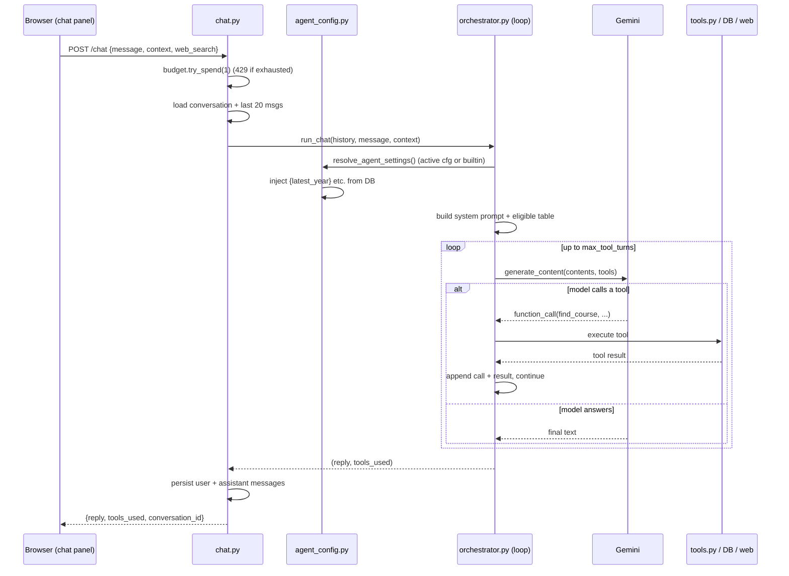
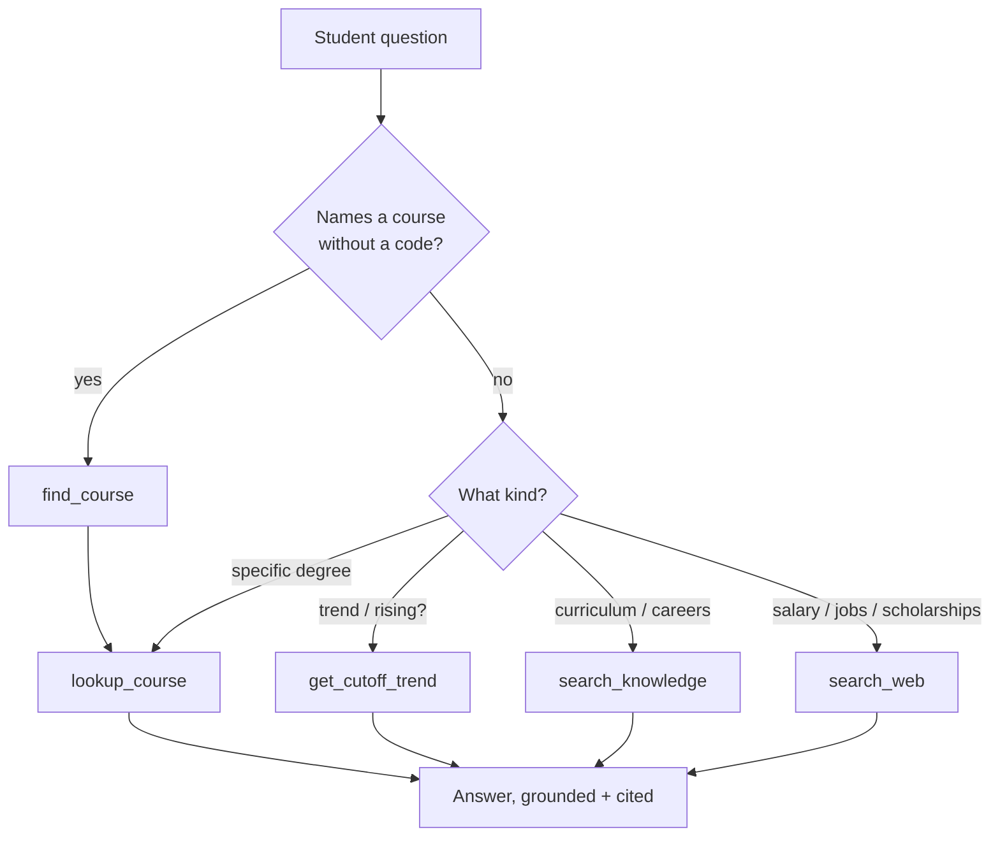

# The AI Advisor Agent (Agentic Loop, No LangChain)

## What this is / why it exists

The AI advisor is the conversational layer a student reaches after seeing their
results — a chat panel that answers "what should I pick?", "is the ECS cutoff
rising?", "what do engineers earn in Sri Lanka?". It is a **single AI agent
with five tools**, running a **hand-written function-calling loop** on Google
Gemini. There is no LangChain, no LlamaIndex, no agent framework — the loop is
~90 readable lines in `core/chat/orchestrator.py`.

Crucially, it is **not a multi-agent system**: one model reasons and, when it
needs a fact it does not have (this year's cutoff, a curriculum, a salary),
calls a tool to fetch exactly that, then answers. One brain, a toolbox.

The single most important design property: **the agent already knows the
student.** Every request injects the student's profile *and* their verified
eligible-course list into the system prompt, with a standing instruction never
to recommend a course they cannot get into. That grounding is what separates
it from a generic chatbot.

---

## Files in this subsystem

| File | Responsibility |
| --- | --- |
| `core/chat/orchestrator.py` | The agentic loop: builds the system prompt, declares the tools to Gemini, runs the turn loop (call tool → feed result → repeat), returns `(reply, tools_used)`. |
| `core/chat/tools.py` | The five tool implementations (`find_course`, `search_knowledge`, `lookup_course`, `get_cutoff_trend`, `search_web`) plus the trusted-domain scoring for web search. |
| `core/chat/agent_config.py` | Runtime resolution of *how* the agent behaves — the active admin config or the built-in default — with live facts injected into the prompt template. TTL-cached. |
| `apps/api/routers/chat.py` | The HTTP endpoint `POST /api/v1/chat`: budget check, conversation load/create, calls the loop, persists the exchange. |
| `apps/api/routers/admin_agent.py` | Admin CRUD for `agent_configs` (versioned), the config **sandbox** (test a draft), and usage stats. Detailed in `09-admin-backend.md`. |
| `core/rag/retrieval.py` | The hybrid retrieval `search_knowledge` calls (documented fully in `07-rag-knowledge.md`). |
| `web/src/components/student/chat-panel.tsx` | The student UI — floating bubble + inline tab, the web-search toggle, tool badges, saved history for signed-in students. See `11-student-frontend.md`. |

> **Jargon.** *Agentic loop / function calling*: the model is told what tools
> exist; instead of answering directly it can emit a structured "call
> `lookup_course('012')`" request; our code runs it and feeds the result back;
> the model then continues. *System prompt*: the hidden instructions that frame
> every conversation. *Embedding / RAG*: see `07-rag-knowledge.md`.

---

## How it works — one message, end to end

### Step 1 — The request arrives (`apps/api/routers/chat.py`)

The browser posts to `/api/v1/chat` (via the open BFF proxy) with a
`session_id`, optional `conversation_id`, the `message`, the student `context`,
and a `web_search` flag. The router:

1. **Checks the daily Gemini budget** (`gemini_budget.try_spend(1)`). If the
   day's provider quota is exhausted, it returns a polite `429` — *"the AI
   advisor has reached today's capacity; your results still work"* — and never
   touches Gemini. Eligibility and recommendations are unaffected.
2. **Loads or creates the conversation** and replays the **last 20 messages**
   as history (10 turns of context).
3. Calls `run_chat(...)`.
4. **Persists** the user message and the assistant reply (with the list of
   tools used stored in `messages.tool_calls`), and bumps `updated_at`.

### Step 2 — Resolve behaviour (`core/chat/agent_config.py`)

Before the loop runs, `resolve_agent_settings(session)` decides *how* the agent
behaves — model, prompt, turn limit, web-search default — from the **active
`agent_configs` row** if one exists, else a **built-in default**. This is the
Phase-4 admin-tunable layer: an admin can change the agent's persona or rules
without a code deploy.

The key trick is **live-fact injection**. The prompt is a *template* with
placeholders `{available_years}`, `{latest_year}`, `{course_count}`, `{today}`.
`_load_facts()` pulls those from the database at call time:

```python
years = SELECT DISTINCT year FROM z_score_cutoffs ORDER BY year DESC
course_count = SELECT count(*) FROM courses WHERE is_active
# -> {"available_years": "2024, 2023, 2022", "latest_year": "2024",
#     "course_count": "265", "today": "July 13, 2026"}
```

`render_template()` substitutes them with **exact-token replacement, never
`str.format`** — so an admin can paste prompt text containing stray `{}` braces
without crashing the renderer. This is why the prompt can *never* drift from the
data again: the original prompt once hardcoded "2019–2023" and "261 courses",
which silently went stale after a new year was promoted. Now those numbers are
always live.

A **30-second TTL cache** keeps this resolution off the per-message hot path;
activating a config in the admin router invalidates the cache in-process
immediately (`invalidate_agent_config_cache()`), and other processes converge
within the TTL.

### Step 3 — Build the system prompt (`_build_system_prompt`)

The resolved base prompt is appended with two **code-owned** sections (data
plumbing, not admin-tunable):

- **Web-search mode** (if the student toggled it on): an instruction to call
  `search_web` for *every* question and prioritise freshness.
- **The student's profile + eligible-course table.** The student's Z-score,
  district, stream, subjects, exam year, and interests are formatted, and their
  **verified eligible courses** are rendered as a markdown table (course, code,
  university, cutoff, margin, bucket — up to 40 rows). The standing instruction:

  > *"When they ask about interests, career paths, or 'what should I choose',
  > always filter THIS list first — never recommend a course they cannot get
  > into."*

So the model is physically incapable of suggesting an out-of-reach course
without ignoring an explicit table in its own context.

### Step 4 — The turn loop (`chat()` in `orchestrator.py`)

The prior messages + the new message are converted to Gemini `Content` objects.
Then, up to `agent.max_tool_turns` times (default 6):

1. Call `gen_client.models.generate_content(model, contents, config)` with all
   five `FunctionDeclaration`s attached.
2. Scan the response parts. If there's a **function call**, run the tool via
   `_execute_tool(...)`, append the model's call *and* the tool's result to
   `contents`, and loop again.
3. If there's **no function call**, the model has produced its final text —
   return `(reply, tools_used)`.

If the loop exhausts its turns without a final answer, it returns a graceful
"couldn't complete that — try a more specific question." Every tool name used
is collected into `tools_used`, which the UI shows as little badges under the
reply.



---

## The five tools (`core/chat/tools.py`)

The tools are declared in a deliberate **priority order** — structured DB facts
first, curated knowledge next, live web last:

| # | Tool | What it does | When the model uses it |
| --- | --- | --- | --- |
| 1 | `find_course(name_query)` | Fuzzy name/abbreviation → course code(s). Expands 30+ abbreviations (`ECS` → "Electronics Computer Science"), then a 3-strategy DB search (all terms → drop one → any single meaningful term). | First, whenever a student names a course it doesn't have a code for. |
| 2 | `lookup_course(course_number)` | Full factsheet (all chunks, ordered) **+** latest-year cutoffs — union of `z_score_cutoffs` *and* `course_stream_cutoff_overrides` so stream-split courses (e.g. 107L) don't vanish. | Any question about a specific degree. |
| 3 | `get_cutoff_trend(course_code)` | Year-by-year cutoff history for a full Uni-Code (e.g. `008B`), overrides unioned in. | "Is the cutoff rising/falling?" / multi-year questions. |
| 4 | `search_knowledge(query)` | Hybrid RAG over the factsheet/article knowledge base (pgvector + FTS + RRF, top-5 chunks). | Curriculum, career paths, degree comparisons. |
| 5 | `search_web(query)` | Live DuckDuckGo (`ddgs`), **trust-ranked**: scopes to authoritative `.lk`/professional-body domains by topic, badges `[Trusted source]`. | Salaries, job market, scholarships, professional-body rules — things that change. |

The division of labour is explicit in the prompt: **exact facts (cutoffs,
codes) always come from the DB tools, never the web.** The web is only for live,
changing information.

### The web-search trust ranking

`search_web` does not just query DuckDuckGo. It:

1. Picks **priority domains by topic** — e.g. a salary query scopes to
   `topjobs.lk`, `lmd.lk`; an accreditation query to `iesl.lk`, `slmc.lk`
   (`_TOPIC_PRIORITY`).
2. Runs the scoped query and a general query **concurrently**.
3. Merges, deduplicates by URL, and **sorts by a trust score** (2 = known
   authoritative domain, 1 = `.lk`/`.ac`, 0 = unknown), tagging trusted hits
   `[Trusted source]`.

So the model is steered toward Sri-Lanka-authoritative sources rather than
whatever ranks first on a generic search.



---

## Config-driven behaviour & the sandbox

`agent_configs` (migration 40) is **versioned**: many rows, at most one
`is_active` (a partial unique index enforces it). Each row stores
`system_prompt_template`, `model_name`, `max_tool_turns`, `web_search_default`.
The admin panel (see `09-admin-backend.md`, `10-admin-frontend.md`) lets an
admin:

- Edit and activate a config (invalidates the cache instantly).
- Run a **sandbox** test — the loop can be called with an explicit `agent`
  argument, so a *draft* config is exercised against a real message without
  activating it.
- See usage stats (message counts, tool-usage mix) on the dashboard.

The built-in `DEFAULT_PROMPT_TEMPLATE` (in `agent_config.py`) is the fallback
when no config is active — a fully-formed advisor persona with scope, a
mandatory tool-use protocol ("never say 'I can't find this course' without
calling `find_course` first"), a mandatory answer format, and eight rules
(never guess a cutoff, cite sources, be honest about data age, personalise…).

---

## Guardrails

| Guard | Mechanism |
| --- | --- |
| **Cost / abuse** | Daily Gemini budget (`gemini_budget`); a 429 when exhausted, never a runaway bill. Per-minute chat rate limit (W1). |
| **Context bound** | Only the last 20 messages are replayed — bounded prompt size and cost. |
| **Hallucinated cutoffs** | Prompt forbids guessing Z-scores; the model must call `lookup_course`/`get_cutoff_trend`. Tool errors are returned as strings the model sees ("Tool error: …"), not silently swallowed. |
| **Out-of-reach recommendations** | The verified eligible table is in every prompt with a never-recommend-outside-it rule. |
| **Untrustworthy web** | Trust-ranked results; the prompt says to discard untrusted results silently. |
| **Accountability** | Every conversation + reply is persisted; admins can review any thread and flag it (`09-admin-backend.md`). |

---

## Freshness fixes (applied)

Two spots had gone stale relative to recent changes and were fixed in the same
pass that produced this documentation:

1. **The injected eligible-table legend** (`orchestrator.py`,
   `_build_system_prompt`) used to say *"Ambitious = right at the edge (within
   ~0.05)"*. But the 2026-07-13 rework made "Ambitious" the *above-your-score*
   later-rounds tab, and the eligible list passed to chat now contains only
   `safe`/`consider` buckets. The legend now describes only Safe/Consider and
   explicitly notes the Ambitious/later-rounds set is **not** in the eligible
   table (so the agent never presents it as reachable).
2. **`lookup_course` hard-coded "2023"** in its cutoff label (`tools.py`) even
   though the query uses `MAX(year)`. It now fetches the latest year and prints
   it, so the agent always quotes the correct year (principle 2, year-agnostic —
   see `16-design-decisions.md`).

---

## Related docs

- `07-rag-knowledge.md` — how `search_knowledge` retrieves (pgvector + FTS + RRF).
- `05-eligibility-engine.md` / `06-scoring-recommendations.md` — where the eligible-course table the agent trusts comes from.
- `09-admin-backend.md` — the `agent_configs` CRUD + sandbox API.
- `11-student-frontend.md` — the chat panel UI and the web-search toggle.
- `13-auth-security.md` — the budget/rate-limit guards and the anonymous session model.
