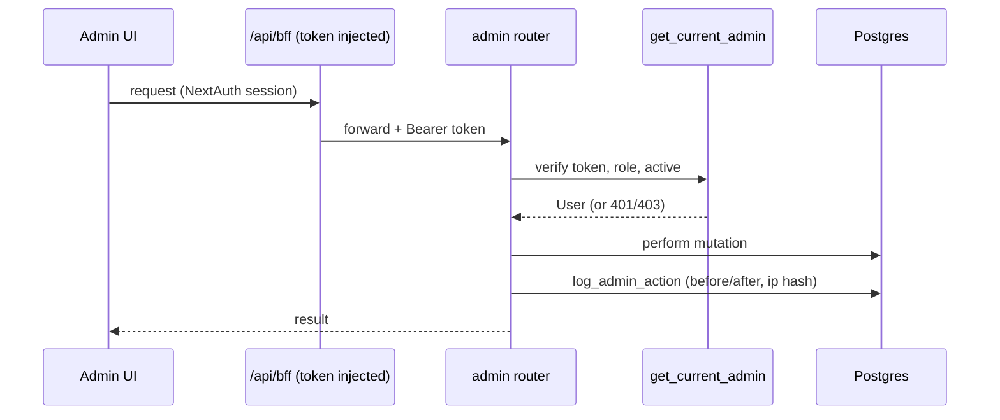

# The Admin Panel — Backend (API)

## What this is / why it exists

Everything an admin does — run the yearly ingestion, edit cutoffs/courses/
factsheets/articles, tune the AI agent, review conversations, manage admins — is
served by a set of FastAPI routers under the `/api/admin` prefix. This doc
enumerates every router and endpoint and the two cross-cutting patterns that
apply to all of them: **admin-gating** and **audit logging**. The admin *UI*
that calls these is in `10-admin-frontend.md`.

---

## Files in this subsystem

| File | Prefix | Responsibility |
| --- | --- | --- |
| `apps/api/routers/admin_ingestions.py` | `/api/admin` | The full handbook ingestion lifecycle (see `04-ingestion-pipeline.md`). |
| `apps/api/routers/admin_cutoffs.py` | `/api/admin/cutoffs` | The cutoff matrix viewer/exporter. |
| `apps/api/routers/admin_courses.py` | `/api/admin` | Course CRUD + stream-eligibility editor + onboarding panel. |
| `apps/api/routers/admin_aliases.py` | `/api/admin` | Course alias CRUD. |
| `apps/api/routers/admin_requirements.py` | `/api/admin` | Subject-rule listing. |
| `apps/api/routers/admin_factsheets.py` | `/api/admin` | Factsheet list/edit + reindex. |
| `apps/api/routers/admin_articles.py` | `/api/admin` | Knowledge-article CRUD + reindex (Phase 8.6). |
| `apps/api/routers/admin_knowledge.py` | `/api/admin` | The indexed-knowledge browser + staleness + reindex-stale. |
| `apps/api/routers/admin_agent.py` | `/api/admin` | Agent-config CRUD, activate/deactivate, and the sandbox test. |
| `apps/api/routers/admin_conversations.py` | `/api/admin` | Conversation viewer, flag toggle, and the usage dashboard feed. |
| `apps/api/routers/admin_users.py` | `/api/admin` | Admin/user management. |
| `apps/api/admin_audit.py` | — | `log_admin_action` — the audit-write helper. |
| `apps/api/dependencies.py` | — | `get_current_admin` — the gate on every route. |

---

## The two cross-cutting patterns

### 1. Admin gating (`get_current_admin`)

Every admin router declares `dependencies=[Depends(get_current_admin)]`, so
**no admin endpoint runs without a valid admin token**. The dependency
(`apps/api/dependencies.py`):

- Reads the `Authorization: Bearer <jwt>` header (`HTTPBearer`).
- `decode_access_token` — verifies signature + expiry; `401` if missing/invalid.
- `403` if the token's `role` isn't `admin`/`superadmin`.
- Loads the user and confirms `is_active`; `401` otherwise.

See `13-auth-security.md` for the token itself and how the frontend supplies it.

### 2. Audit logging (`log_admin_action`)

Every **mutation** writes an `admin_actions` row via `log_admin_action(db,
admin=…, action_type=…, target_table=…, target_id=…, before=…, after=…,
request=…)` — capturing the admin, a before/after JSON snapshot, and a hashed
IP. This is the accountability layer: any change is attributable and reversible
by inspection. Action types include `course.update`, `course.streams_update`,
`ingestion.promote`, `article.create`, `factsheet.update`, and so on.

---

## Endpoint catalogue

### Ingestions (`admin_ingestions.py`) — the pipeline lifecycle

| Method + path | Does |
| --- | --- |
| `POST /ingestions/upload-ticket` | mint a 10-min token for the direct browser upload |
| `POST /ingestions` | accept a handbook PDF (async) or reviewed CSV (sync) |
| `GET /ingestions` / `GET /ingestions/{run_id}` | list / detail runs |
| `POST /ingestions/{run_id}/extract` | re-extract with an admin-supplied page range |
| `GET /ingestions/{run_id}/columns` | the extracted columns for review |
| `PATCH /ingestions/{run_id}/columns/{column_id}` | confirm/ignore/tag one column |
| `POST /ingestions/{run_id}/columns/confirm-suggested` | bulk-confirm exact suggestions |
| `POST /ingestions/{run_id}/mapping/confirm` | build the CSV, learn aliases, run the diff |
| `GET /ingestions/{run_id}/csv` | download the extracted CSV |
| `GET /ingestions/{run_id}/changes` | the handbook change-set |
| `PATCH /ingestions/{run_id}/changes/{change_id}` | approve/reject a change |
| `POST /ingestions/{run_id}/changes/apply` | apply approved added/removed changes |
| `POST /ingestions/{run_id}/promote` | commit cutoffs live (+ snapshot, archive, checklist) |

### Courses (`admin_courses.py`) — incl. Phase 8

| Method + path | Does |
| --- | --- |
| `GET /courses` / `POST /courses` / `PATCH /courses/{code}` | list / create / edit |
| `GET /courses/onboarding` | the live "needs onboarding" panel (blockers per course) |
| `GET /courses/{code}/streams` / `PUT /courses/{code}/streams` | stream-eligibility editor (replace-set, with the zero-stream warning) |

### Cutoffs (`admin_cutoffs.py`)

`GET /cutoffs/years`, `GET /cutoffs/matrix`, `GET /cutoffs/export` — the
year-by-district cutoff matrix and CSV export.

### Factsheets, Articles, Knowledge (RAG admin — see `07-rag-knowledge.md`)

| Router | Endpoints |
| --- | --- |
| `admin_factsheets` | `GET /factsheets`, `GET/PUT /factsheets/{course_number}`, `POST /factsheets/{course_number}/reindex` |
| `admin_articles` | `GET /articles`, `GET/POST/PUT/DELETE /articles/{id}` |
| `admin_knowledge` | `GET /knowledge`, `GET /knowledge/{source_id}/chunks`, `POST /knowledge/reindex-stale` |

A factsheet/article save bumps `version`, writes the audit row, and enqueues a
single-item reindex job.

### AI Advisor config (`admin_agent.py` — see `08-ai-agent.md`)

| Method + path | Does |
| --- | --- |
| `GET /agent-configs` / `GET /agent-configs/default` | list configs / the builtin default |
| `POST /agent-configs` | create a version |
| `POST /agent-configs/{config_id}/activate` / `POST /agent-configs/deactivate` | switch the active config (invalidates the runtime cache) |
| `POST /agent-configs/test` | the **sandbox** — run a draft config against a real message without activating it |

### Conversations & usage (`admin_conversations.py`)

`GET /conversations` (list, filterable), `GET /conversations/{id}` (full thread
+ tool badges), `PATCH /conversations/{id}` (flag toggle), `GET /usage` (the
dashboard feed: conversation/message counts, tool-usage mix, eligibility stats).

### Aliases, Requirements, Users

`admin_aliases`: `GET/POST/PATCH/DELETE /aliases`. `admin_requirements`:
`GET /requirements`. `admin_users`: `GET/POST /users`, `PATCH /users/{user_id}`
(create/deactivate admins; all admins are equal per decision D5).

---

## Key design decisions & gotchas

- **Raw `text()` SQL over verified columns.** The admin routers favour explicit
  SQL for clarity and to keep audit snapshots simple, rather than heavy ORM
  machinery.
- **Gate at the router, audit at the mutation.** The two patterns are uniform —
  a new admin endpoint gets both by construction.
- **Config activation invalidates the cache.** Activating an agent config calls
  `invalidate_agent_config_cache()` so the change is live within the process
  immediately (others converge within the 30 s TTL).
- **Onboarding is derived, never stored.** `GET /courses/onboarding` computes
  blockers live from the data every call — no placeholder rows (Phase 8 design
  principle).

---

## Related docs

- `04-ingestion-pipeline.md` — the ingestion endpoints in depth.
- `07-rag-knowledge.md` — factsheets/articles/knowledge.
- `08-ai-agent.md` — the agent-config layer.
- `10-admin-frontend.md` — the UI that calls all of this.
- `13-auth-security.md` — `get_current_admin` and the token flow.
