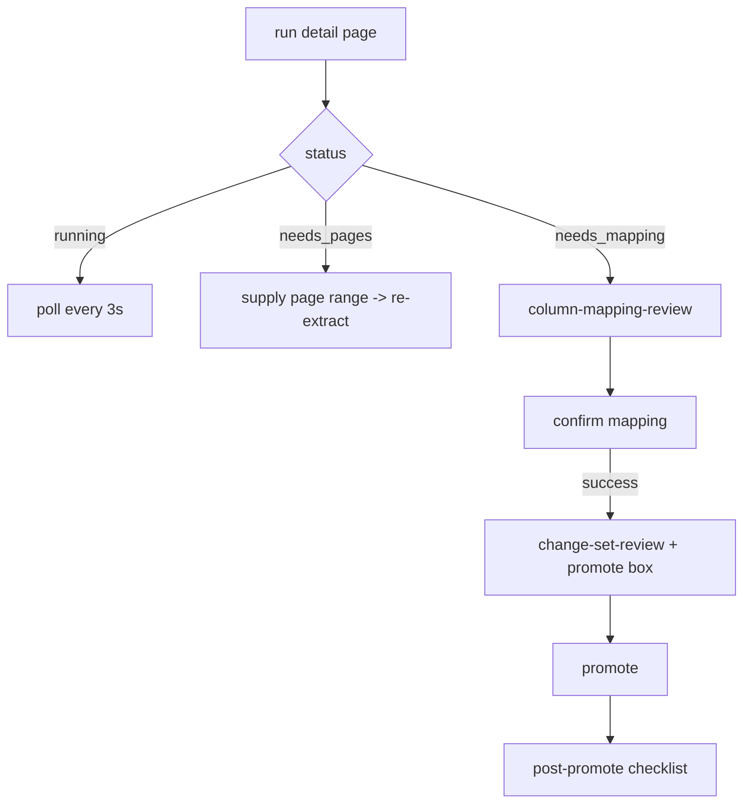

# The Admin Panel — Frontend

## What this is / why it exists

The admin UI is the operator console: the pages an admin uses to run the yearly
ingestion, edit content, tune the AI, and review usage. It is part of the same
Next.js 14 app as the student frontend, living under `web/src/app/admin/`, and
it talks to the backend through the authenticated `/api/bff` proxy (which
injects the admin token — see `13-auth-security.md`). This doc maps every page
and the review components. The backend it calls is in `09-admin-backend.md`.

---

## Files in this subsystem

### Pages (`web/src/app/admin/`)

| Route | File | What it does |
| --- | --- | --- |
| `/admin/login` | `login/page.tsx` | Admin sign-in. |
| `/admin` | `(panel)/page.tsx` | Dashboard — usage cards. |
| — | `(panel)/layout.tsx` | The panel shell (sidebar + header + auth guard). |
| `/admin/ingestions` | `(panel)/ingestions/page.tsx` | Upload + run list (with the year-exists guard). |
| `/admin/ingestions/{id}` | `(panel)/ingestions/[runId]/page.tsx` | One run: mapping review, change-set, promote, checklist. |
| `/admin/cutoffs` | `(panel)/cutoffs/page.tsx` | The year-by-district cutoff matrix. |
| `/admin/courses` | `(panel)/courses/page.tsx` | Course list, edit dialog (+ stream checkboxes), needs-onboarding panel. |
| `/admin/conversations` | `(panel)/conversations/page.tsx` | Conversation list. |
| `/admin/conversations/{id}` | `(panel)/conversations/[conversationId]/page.tsx` | Full thread + tool badges + flag. |
| `/admin/agent` | `(panel)/agent/page.tsx` | AI Advisor config editor + sandbox. |
| `/admin/factsheets` | `(panel)/factsheets/page.tsx` | Factsheet coverage list. |
| `/admin/factsheets/{n}` | `(panel)/factsheets/[courseNumber]/page.tsx` | Factsheet editor (with staleness). |
| `/admin/knowledge` | `(panel)/knowledge/page.tsx` | Indexed-knowledge browser + reindex. |
| `/admin/aliases` | `(panel)/aliases/page.tsx` | Alias management. |
| `/admin/requirements` | `(panel)/requirements/page.tsx` | Subject-rule coverage. |
| `/admin/admins` | `(panel)/admins/page.tsx` | Admin user management. |

### Shared components (`web/src/components/admin/`)

| File | What it does |
| --- | --- |
| `sidebar.tsx` | The left nav (Dashboard, Ingestions, Cutoffs, Conversations, AI Advisor, Aliases, Courses, Subject Rules, Factsheets, Knowledge, Admins). |
| `usage-cards.tsx` | Dashboard cards — conversations, eligibility checks, tool-usage mix, years-viewed. Derived live; nothing hardcoded. |
| `column-mapping-review.tsx` | The ingestion mapping-review UI — confirm/ignore/tag each extracted column. |
| `change-set-review.tsx` | The handbook change-set UI — approve/reject added/removed/changed, then apply. |

---

## The ingestion review flow (the richest admin surface)

The `[runId]` page is where the yearly loop is driven. Its state follows the
run's status:

- **`column-mapping-review.tsx`** shows each extracted column with its suggested
  course, whether it has real z-scores, and stream-variant suggestions. The admin
  confirms, ignores, or tags each, then confirms the mapping.
- **`change-set-review.tsx`** shows the diff (added/removed/cutoff-changed). Note
  the documented UX gotcha: the "Apply N approved changes" button only counts
  *added/removed* course changes — cutoff changes go live at **promote**, so the
  button can legitimately read "Apply 0" under many approved cutoff cards (a
  polish item is logged).
- **The promote checklist** renders coverage gaps, override/codeless counts,
  "students now see YYYY", and (Phase 8.3) "new courses: X of Y onboarded".

---

## The courses page (Phase 8)

`courses/page.tsx` combines the course table, an edit dialog with **stream
eligibility checkboxes** (with the zero-stream amber warning that keeps the
dialog open so the admin sees it), and the **"Needs onboarding" panel** — a live
list of every course missing something (inactive / no streams / no factsheet),
each with its blockers as badges and deep links to fix them. This panel is
computed from `GET /courses/onboarding` on every load.

---

## The upload flow (direct-to-API)

`ingestions/page.tsx` does not send the handbook through the BFF (Vercel's
4.5 MB cap). Instead it fetches an upload ticket + the API base URL
(`/api/upload-info`) and POSTs the file straight to the API with the ticket.
See `12-infrastructure-deployment.md` and `13-auth-security.md`.

---

## Honest status note

The **knowledge-articles editor page is not yet built.** The backend
(`admin_articles.py`), the worker indexer (`index_articles.py`), the `articles`
table, and its tests all exist (Phase 8.6), but there is no
`admin/(panel)/articles/page.tsx` and no sidebar entry for it yet — that admin UI
page is the remaining piece of 8.6.

---

## Key design decisions & gotchas

- **One Next.js app, two audiences.** The admin panel and student flow share the
  codebase, the BFF, and the deploy — separated by route and auth, not by app.
- **Everything derived, nothing hardcoded.** Usage cards, onboarding, and years
  all read live from the API, so a new handbook needs no UI change.
- **Auth is server-side.** The panel holds only the NextAuth session cookie; the
  API token is injected by the proxy and never reaches these components.
- **The "Apply 0" button** is working-as-designed but reads as broken — logged as
  a polish item.

---

## Related docs

- `09-admin-backend.md` — the endpoints every page calls.
- `04-ingestion-pipeline.md` — what the review UI is reviewing.
- `07-rag-knowledge.md` — the factsheet/knowledge editors' effect.
- `13-auth-security.md` — the BFF token injection behind every admin call.
