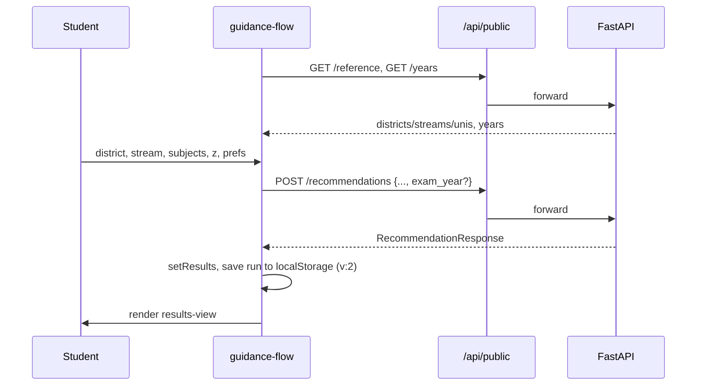

# The Student Frontend

## What this is / why it exists

The student-facing web app: a five-step guidance form, a results view with three
tabs / year switching / cutoff trends, and the AI chat panel. It is a Next.js 14
(App Router) application in `web/`, styled with Tailwind, that talks to the
FastAPI backend through a thin proxy layer (the **BFF**). This doc covers the
student half; the admin half is in `10-admin-frontend.md`.

---

## Files in this subsystem

| File | Responsibility |
| --- | --- |
| `web/src/components/student/guidance-flow.tsx` | The stateful multi-step flow: collects Z-score, district, stream, subjects, preferences; fetches reference data + years; submits; owns the saved-run restore logic. |
| `web/src/components/student/results-view.tsx` | Renders results: the three tabs (Safe / Consider / Ambitious), the exam-year switcher, cutoff-trend chips + popover, the also-offered list, per-course score breakdown. |
| `web/src/components/student/chat-panel.tsx` | The AI advisor UI — floating bubble or inline tab, web-search toggle, tool badges, saved history for signed-in students. |
| `web/src/lib/guidance-types.ts` | TypeScript types that **mirror the backend Pydantic schemas exactly** (the frontend/backend contract). |
| `web/src/app/api/public/[...path]/route.ts` | Open BFF proxy → `/api/v1/*` (no auth): reference, years, recommendations, cutoff-history, chat. |
| `web/src/app/api/bff/[...path]/route.ts` | Authenticated BFF proxy → `/api/*` (admin), injects the bearer token. |
| `web/src/app/api/upload-info/route.ts` | Hands the browser the API base URL for the direct handbook upload (admin). |

> **Jargon.** *BFF (Backend-For-Frontend)*: the Next.js server sits between the
> browser and FastAPI and proxies calls. The browser never talks to FastAPI
> directly (except the one deliberate direct-upload). This keeps auth on the
> server and avoids CORS for normal traffic. *localStorage*: per-browser
> key-value storage that survives reloads.

---

## The five-step flow (`guidance-flow.tsx`)

The student answers, in order: (1) district, (2) stream, (3) three A/L subjects
+ grades, (4) Z-score, (5) optional preferences (universities, interests). On
the final step, `submit()` posts to `/api/public/recommendations`.

On load, two fetches run: `/api/public/reference` (districts, streams,
universities) and `/api/public/years` (promoted exam years). Years are
progressive enhancement — if that fetch fails, the flow still works and simply
omits `exam_year`, letting the engine serve its default (latest).

### Saved-run restore + the version gate

To spare returning students from re-entering everything, a completed run is
saved to `localStorage` and restored on next load. This is **versioned**:

- Saves are stamped `v: 2`.
- On restore, the gate `if (!saved?.results || saved.v !== 2) return;` discards
  any payload of a different shape.

This exists because a real bug happened: after the later-rounds feature shipped,
browsers restored *pre-feature* saved runs that lacked the `later_round_*`
fields, and the new Ambitious tab crashed on `undefined.toFixed()`. The version
gate kills the entire class of "old save meets new code" crashes — an affected
student simply re-runs the five steps once (see `16-design-decisions.md` §2.5).

### The remembered-year guard

A restored `examYear` is validated against the server's `/years`; if the server
no longer offers it (an admin relabeled/removed that dataset), it is dropped and
the request re-runs against the engine default. This prevents the "ghost year"
empty-results bug.

---

## The results view (`results-view.tsx`)

### Three tabs (user decision 2026-07-13)

Results are presented as three pill-tabs, opening on the first non-empty one:

| Tab | Contents | Order |
| --- | --- | --- |
| **Safe** | Eligible, comfortably above cutoff (`bucket == "safe"`) | highest cutoff first (no-pref mode) |
| **Consider** | Eligible, clears the cutoff (some narrowly) (`bucket == "consider"`) | highest cutoff first |
| **Ambitious** | **Above** the student's score, within +0.15 (`later_round`) | highest cutoff first |

The Ambitious tab is *not* eligibility — it carries the later-rounds
explanation ("seats freed after the first UGC round have admitted near-miss
students; not guaranteed") and per-card "+0.0xxx above you" chips. All
later-round fields are read through safe defaults (`results.later_round ?? []`,
`?? 0.15`) so a stale saved run can never crash the tab.

### Year switcher & trends

When more than one year is promoted, a "Viewing YYYY cutoffs ▾" selector
re-runs the recommendation for the chosen year. A prominent banner appears for
any non-latest year ("reference only — cutoffs shift each year"). Each course
card shows a **cutoff-trend chip** (↑/↓ vs the prior year) with a popover of the
year-by-year numbers, fed by a single `/cutoff-history` call per (district,
stream) — stream-aware so it matches the engine's override semantics.

### Per-course breakdown

Each card shows the score dimensions (z-margin, industry, …) as labeled bars,
the cutoff-vs-you slider, medium tags, and the aptitude-test badge for
conditional courses.

---

## The chat panel (`chat-panel.tsx`)

Two render modes: a **floating** bubble (bottom-right, any page) and an
**inline** full-height tab beside the results. Key behaviours:

- Anonymous students get a random `session_id` (stored in `localStorage`);
  signed-in students (`next-auth` Google) additionally get **saved history** they
  can browse and resume (`/api/student/conversations`).
- The **web-search toggle** (globe icon) sets `web_search` on each request.
- Each request sends the full student `context` (profile + eligible list) so the
  agent is grounded (see `08-ai-agent.md`).
- Replies render markdown-bold + newlines and show **tool badges** (which tools
  the agent used) under each answer.
- A permanent footer: signed-in → "your chats are saved"; anonymous → "sign in
  to save history · AI can make mistakes — verify at ugc.ac.lk".

---

## The BFF proxy pattern

The browser has **three** server routes, not a direct line to FastAPI:

| Route | Auth | Forwards to | Used for |
| --- | --- | --- | --- |
| `/api/public/[...path]` | none | `/api/v1/*` | student reference, years, recommendations, cutoff-history, chat |
| `/api/bff/[...path]` | NextAuth session (admin) | `/api/*` | every admin call; injects the bearer token server-side |
| `/api/upload-info` | admin | returns API base URL | the direct handbook upload |

The public proxy forwards `x-forwarded-for` so the API's per-IP rate limiter
sees the real client. The auth proxy reads the FastAPI token out of the
encrypted Auth.js session and attaches it as `Authorization: Bearer …` — the
token **never reaches the browser** (see `13-auth-security.md`).

---

## The type contract (`guidance-types.ts`)

Every response shape the frontend consumes is typed here to mirror the backend
Pydantic models exactly — `RecommendationResponse`, `ScoredRecommendation`,
`ExamYear`, `CutoffHistory`, etc. The file's own header says it: *"Keep in sync
with the backend — these are not independently-sourced types."* This is the
single place to check when the API contract changes.

---

## Key design decisions & gotchas

- **Progressive enhancement.** Years/trends/chat are additive; if any fails the
  core flow still works. Nothing student-critical depends on an optional fetch.
- **Server truth wins.** After a submit, `examYear` is set from
  `data.exam_year_used` (what the engine actually used), not what the client
  asked for — so a fallback is reflected honestly.
- **Version your persisted shapes.** The `v:2` gate is the general fix for
  cross-deploy localStorage crashes; bump it whenever the results shape changes.

---

## Related docs

- `06-scoring-recommendations.md` — where the buckets and `later_round` come from.
- `08-ai-agent.md` — the chat backend the panel talks to.
- `10-admin-frontend.md` — the admin half of the same Next.js app.
- `13-auth-security.md` — the BFF token-injection detail.
