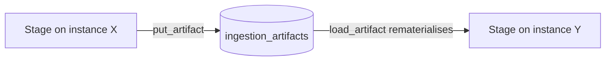

# Infrastructure, Deployment & the Split-Service Architecture

## What this is / why it exists

This doc explains how the platform actually runs in production: which managed
services host it, how the two processes become two separate machines, the
problems that split created, and how each was solved. It also covers the
production migration method, the direct-upload path, rate limiting, and the key
environment variables. Local dev is Ubuntu on WSL2; production is fully managed
(no self-hosted servers).

---

## Files in this subsystem

| File | Responsibility |
| --- | --- |
| `apps/worker/settings.py` | arq `WorkerSettings`: registered jobs, Redis connection, `job_timeout` (3600 s). |
| `apps/api/queue.py` | The API's enqueue helpers (`enqueue_extract_pdf`, `enqueue_index_factsheet`, `enqueue_index_article`) — short-lived arq pools. |
| `core/ingestion/artifact_store.py` | The cross-instance DB artifact store (write-through to Postgres, local cache). |
| `apps/api/guards.py` | Per-IP rate limiting middleware + the daily Gemini budget. |
| `core/ratelimit.py` | The sliding-window limiter + daily-budget primitives. |
| `scripts/apply_prod_migrations.py` | The production migration runner (hand-reviewed guarded SQL via asyncpg). |
| `core/config.py` | All env-driven settings. |
| `docs/W2_PROD_PARITY_RUNBOOK.md` | The click-by-click production bring-up runbook. |

---

## Production topology

```mermaid
flowchart TD
    subgraph Vercel
      NX[Next.js app + BFF]
    end
    subgraph RenderAPI[Render - Web Service]
      API[FastAPI / uvicorn]
    end
    subgraph RenderWK[Render - Background Worker]
      WK[arq worker]
    end
    SUPA[(Supabase Postgres<br/>+ pgvector<br/>via Session Pooler]]
    UP[(Upstash Redis<br/>rediss:// TLS)]
    GEM[Gemini API]

    NX -->|HTTPS| API
    NX -.->|direct upload| API
    API -->|SQL| SUPA
    API -->|enqueue| UP
    UP -->|dequeue| WK
    WK -->|SQL| SUPA
    API --> GEM
    WK --> GEM
```

| Service | Provider | Notes |
| --- | --- | --- |
| Frontend | **Vercel** | Next.js + the BFF route handlers. |
| API | **Render Web Service** | `uvicorn apps.api.main:app`. |
| Worker | **Render Background Worker** | `arq apps.worker.settings.WorkerSettings`. **Separate machine** from the API. |
| Database | **Supabase** | Managed Postgres + pgvector. Reached via the **Session Pooler**. |
| Broker | **Upstash** | Managed Redis over TLS (`rediss://`). |
| AI | **Google Gemini** | Chat + embeddings. |

### Why the Supabase Session Pooler (not the direct host)

Supabase's *direct* database host resolves **IPv6-only**. The WSL dev box and
the Render worker had no IPv6 route, so direct connections failed with "Network
is unreachable." The **Session Pooler** endpoint (`port 5432`, username
`postgres.<project-ref>`) is IPv4-reachable and is what every connection string
uses. (Diagnosed with `getent ahosts` before changing anything — see
`16-design-decisions.md` §2.10.)

---

## The split-instance problem and the artifact store

The API and worker are **separate machines with separate ephemeral disks**, and
even one machine loses its disk on every deploy. The staged ingestion pipeline
passes files between stages (`{run_id}.pdf`, `grid.json`, `presence.json`,
`csv`, `overrides.json`, `unmapped.json`). A file the API writes is invisible to
the worker, and vice-versa — so a handbook uploaded to the API could never be
extracted by the worker.

**Solution — the DB artifact store** (`core/ingestion/artifact_store.py` +
`ingestion_artifacts` table). Every stage output is written *through* to
Postgres (`put_artifact`) and rematerialised on whichever instance needs it next
(`load_artifact` / `artifact_path` — local cache first, else the DB row, which
it then writes to the cache). The local work-dir file is just a cache.



Because factsheet/article **indexing is DB→DB** (read a row, write chunks), it
already works cross-instance with no file handoff — only the PDF pipeline needed
the artifact store. Verified by tests that wipe the local disk between every
stage (`14-testing-quality.md`).

---

## The arq worker & job timeout

`WorkerSettings.job_timeout = settings.worker_job_timeout_seconds` (**3600 s**).
arq's default is 300 s, which killed the 15 MB handbook's extraction mid-run
(the 2024 book already took 221 s; a bigger book cannot finish in 300 s). The
extraction job also handles `asyncio.CancelledError` (a timeout or abort)
explicitly — marking the run `failed` on a fresh session inside `asyncio.shield`
and re-raising — so a killed job never leaves an orphaned `running` row (see
`16-design-decisions.md` §2.2).

The API enqueues jobs via short-lived arq pools (`apps/api/queue.py`); the
worker holds the long-lived connection.

---

## The direct-to-API upload path

Vercel hard-caps serverless request bodies at **4.5 MB**, but handbooks are
6–22 MB — so the upload cannot go through the BFF. Instead:

1. The BFF mints a **10-minute upload ticket** (a short-lived bearer token) via
   `POST /api/admin/ingestions/upload-ticket`.
2. `/api/upload-info` hands the browser the API base URL.
3. The browser uploads the file **straight to the Render API** with that token;
   the API allows it via **origin-scoped CORS** (`CORS_ALLOW_ORIGINS` set to the
   Vercel origin). Long-lived credentials never touch the browser.

This is the *only* browser→API-direct call in the system (see
`13-auth-security.md`).

---

## Production migrations — guarded asyncpg scripts

Migrations are **not** applied with `alembic upgrade` in production (Alembic's
direct connection had SSL friction against Supabase). Instead
`scripts/apply_prod_migrations.py`:

- Reads `PROD_DATABASE_URL`, **refuses localhost** (a safety rail).
- Applies a chain of pre-generated, human-reviewed SQL files from
  `scripts/prod_sql/`, each wrapped in `BEGIN/COMMIT` and **version-guarded**
  (`UPDATE alembic_version SET version_num='<rev>' WHERE version_num='<prev>'`)
  so a file can only apply on top of the exact expected state.
- **UPDATEs** the single `alembic_version` row, never INSERTs.
- Verifies the version advanced after each step and stops at the first mismatch.

The current production head is migration **43** (`c5d8e2f91a47`, articles).

---

## Rate limiting & the daily budget (`guards.py`, `ratelimit.py`)

Two cost/abuse guards, both in-process:

- **`SlidingWindowLimiter`** — per-IP (first `X-Forwarded-For` hop) request
  limiting on the public tier; chat has its own tighter lane. Returns `429` +
  `Retry-After`. (Verified live: 120 requests pass, the 121st gets `429`.)
- **`DailyBudget`** — a per-UTC-day cap on Gemini calls shared across chat,
  interest embeddings, and the admin sandbox. When exhausted, chat `429`s
  politely and interest-ranking degrades to inert; eligibility never needs
  Gemini, so it is unaffected.

The test transport is exempt (a request with no client), so the suite is never
throttled.

---

## Key environment variables (`core/config.py`)

| Var | Purpose |
| --- | --- |
| `DATABASE_URL` / `DATABASE_URL_SYNC` | async (asyncpg) + sync (psycopg2, Alembic) DSNs |
| `REDIS_URL` | arq broker (`rediss://…` in prod) |
| `JWT_SECRET_KEY` | HS256 admin-token signing |
| `GEMINI_API_KEY` | chat + embeddings |
| `CORS_ALLOW_ORIGINS` | the web origin allowed to upload direct |
| `INGESTION_WORK_DIR` / `ARCHIVE_DIR` | local caches (ephemeral in prod) |
| `WORKER_JOB_TIMEOUT_SECONDS` | 3600 |
| `RATE_LIMIT_CHAT_PER_MINUTE` / `RATE_LIMIT_PUBLIC_PER_MINUTE` / `GEMINI_DAILY_CALL_BUDGET` | the guards |
| `LATER_ROUND_Z_MARGIN` | the Ambitious-tab window (0.15) |

The worker service needs `DATABASE_URL`, `DATABASE_URL_SYNC`, `JWT_SECRET_KEY`,
`REDIS_URL`, `GEMINI_API_KEY`, `INGESTION_WORK_DIR`, `ARCHIVE_DIR` — the shared
`Settings` class is imported by both processes, so all required fields must be
present even on the worker (a missing `JWT_SECRET_KEY` once crashed the worker at
boot).

---

## Key design decisions & gotchas

- **The database is the filesystem.** On ephemeral, horizontally-split infra,
  anything that must survive a deploy or cross a machine boundary goes in
  Postgres (artifacts, snapshots).
- **Guarded, hand-reviewed prod migrations** beat auto-apply against a managed
  DB with connection quirks — every step is reversible and can only run on the
  expected state.
- **Both processes share `core.config.Settings`** — env completeness matters on
  the worker too, not just the API.
- **PDF normalisation is an ops step**, not pipeline code (see
  `04-ingestion-pipeline.md` and `16-design-decisions.md` §2.3).

---

## Related docs

- `04-ingestion-pipeline.md` — the pipeline that depends on the artifact store.
- `13-auth-security.md` — the upload ticket + CORS + rate limiting in depth.
- `16-design-decisions.md` — the incidents behind the timeout, the pooler, and the artifact store.
