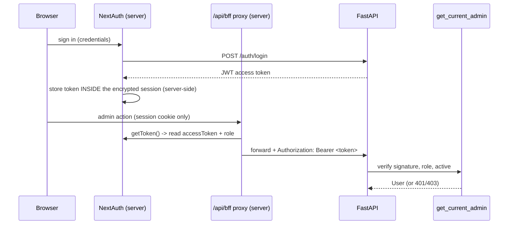

# Authentication & Security

## What this is / why it exists

This doc covers who can do what and how it's enforced: admin authentication
(bcrypt + JWT), student authentication (NextAuth Google + anonymous sessions),
the BFF token-injection pattern that keeps the API token out of the browser, the
direct-upload ticket + CORS, and the cost/abuse guards. Security here is layered:
auth at the edge, gating on every admin route, and a full audit trail behind it.

---

## Files in this subsystem

| File | Responsibility |
| --- | --- |
| `core/security.py` | Pure primitives: `hash_password`/`verify_password` (bcrypt), `create_access_token`/`decode_access_token` (HS256 JWT). |
| `apps/api/routers/auth.py` | `POST /api/auth/login`, `GET /api/auth/me`. |
| `apps/api/dependencies.py` | `get_current_admin` — the gate on every admin route. |
| `apps/api/guards.py` | Per-IP rate limiting + the daily Gemini budget. |
| `web/src/auth.ts`, `web/src/auth.config.ts` | NextAuth (Auth.js) config — Google + credentials, server-side token storage. |
| `web/src/app/api/bff/[...path]/route.ts` | The authenticated proxy that injects the bearer token. |

> **Jargon.** *JWT* = a signed token carrying claims (here `sub` = user id,
> `role`, `exp`). *HS256* = a symmetric signing algorithm keyed by a shared
> secret. *bcrypt* = a slow password hash resistant to brute force. *BFF* =
> Backend-For-Frontend; the Next.js server that proxies the browser's calls.

---

## Admin authentication

### The primitives (`core/security.py`)

- **Passwords** are bcrypt-hashed (`hash_password`), verified in constant time
  (`verify_password`). Inputs are truncated to bcrypt's 72-byte limit
  explicitly. Plaintext is never stored or logged.
- **Tokens** are HS256 JWTs (`create_access_token`) with `sub` (user id),
  `role`, `type: "access"`, `iat`, `exp`. Expiry defaults to
  `jwt_access_token_expire_minutes` (**720 = 12 hours**); `create_access_token`
  accepts an override (used for the 10-minute upload ticket).
- FastAPI is the **JWT authority** — it signs the token; the frontend merely
  carries it.

### The login route & the gate

`POST /api/auth/login` verifies the password and returns an access token;
`GET /api/auth/me` returns the current admin. Every `/api/admin/*` route depends
on `get_current_admin` (`dependencies.py`), which returns:

- `401` — missing or invalid/expired token, or malformed subject, or
  inactive/unknown user.
- `403` — a valid token whose `role` is not `admin`/`superadmin`.

---

## The BFF token-injection pattern (the important one)

The FastAPI access token is stored **inside the encrypted Auth.js session JWT,
server-side** — it is **never sent to the browser**. When the browser makes an
admin call to `/api/bff/[...path]`, the proxy (`route.ts`):

1. `getToken({ req, secret, secureCookie: NODE_ENV === "production" })` reads the
   session and extracts `accessToken` + `role`.
2. Rejects non-admin roles with `401` before forwarding.
3. Attaches `Authorization: Bearer <accessToken>` and forwards to FastAPI.
4. Streams the response back.

**The `secureCookie` nuance (a real bug).** On Vercel (HTTPS) Auth.js stores the
session as `__Secure-authjs.session-token`. `getToken` defaults
`secureCookie=false`, which looks for the non-secure cookie name and the wrong
decryption salt → returns `null` → every admin call `401`s. Forcing
`secureCookie` in production fixes it. And the proxy must export **every HTTP
verb it fronts** — a missing `PUT` once made factsheet save `405` (see
`16-design-decisions.md` §2.6).

This pattern means: FastAPI is never exposed directly for normal traffic, CORS
is unneeded on the API for the proxied path, and the token can't leak from the
browser.

---

## Student authentication

Students need **no account** — the guidance flow and chat are open
(`/api/public/*`). A random `session_id` (in `localStorage`) ties an anonymous
chat together. Optionally a student signs in with **Google** (NextAuth v5); a
signed-in student's `student_id` links their conversations so they can browse and
resume saved history. Signing in is a convenience (saved history), never a gate.

---

## The direct-upload ticket + CORS

Handbook uploads (6–22 MB) can't go through Vercel's 4.5 MB body cap, so:

- The BFF mints a **10-minute** token (`create_access_token(..., 10)`) via
  `POST /api/admin/ingestions/upload-ticket`.
- The browser uploads straight to the Render API with that short-lived token.
- The API permits it via **origin-scoped CORS** (`CORS_ALLOW_ORIGINS` = the
  Vercel origin), bearer-auth, no cookies (so no credentialed CORS).

The exposure window is tiny (10 minutes) and the long-lived session token never
leaves the server. See `12-infrastructure-deployment.md`.

---

## Cost & abuse guards (`guards.py`, `core/ratelimit.py`)

- **Per-IP sliding-window rate limit** on the public tier (chat on a tighter
  lane), keyed on the first `X-Forwarded-For` hop; `429` + `Retry-After` when
  exceeded. The ASGI test transport (no client) is exempt so tests aren't
  throttled.
- **Daily Gemini budget** — a per-UTC-day cap shared across chat, interest
  embeddings, and the sandbox. Exhaustion → a polite chat `429` and inert
  interest ranking; eligibility is unaffected.

---

## Accountability & known follow-ups

- **Audit trail.** Every admin mutation writes `admin_actions` (who, before/after,
  ip hash). `auth_events` records login attempts — the data source for future
  login throttling.
- **Honest gaps** (documented, not yet built): admin login throttling / password
  policy (W3), a session-expiry UX (the 12 h token currently just `401`s the
  panel until re-login), and conversation retention/privacy controls (W4).

---

## Key design decisions & gotchas

- **The token never touches the browser.** The single most important auth
  decision — server-side session storage + proxy injection.
- **Short-lived tickets for the one direct call.** The direct upload trades a
  10-minute token for bypassing a platform limit, without weakening the model.
- **Gate + audit are uniform.** Every admin route has both by construction (see
  `09-admin-backend.md`).

---

## Related docs

- `09-admin-backend.md` — `get_current_admin` on every admin route.
- `11-student-frontend.md` — the anonymous session + Google sign-in on the UI side.
- `12-infrastructure-deployment.md` — CORS, the upload ticket, rate limiting in the prod context.
- `16-design-decisions.md` §2.6 / §2.7 — the 405 and 413 stories.
