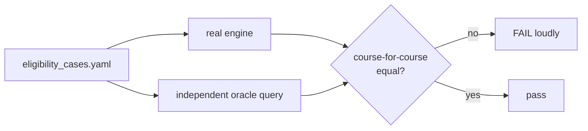

# Testing & Quality

## What this is / why it exists

This is a system where wrong data hurts real students, so the test suite is a
correctness contract, not a formality. There are ~353 tests (unit + integration)
that pin the behaviour of every consequential path — the eligibility verdict,
the ingestion pipeline, the ranking, the guards — and several of them use
patterns worth studying. This doc explains how the suite is structured, the
standout patterns, and what "353 passed" actually guarantees.

Run it with `uv run pytest` (or `.venv/bin/python -m pytest`). `asyncio_mode =
"auto"` (in `pyproject.toml`) means `async def` tests just work.

---

## Structure

| Dir | Kind | Needs a DB? |
| --- | --- | --- |
| `tests/unit/` | Pure-Python logic | no |
| `tests/integration/` | Against a real test database + the ASGI app | yes |
| `tests/conftest.py` | Shared fixtures (`db_session`, `client`) | — |
| `tests/fixtures/eligibility_cases.yaml` | Declarative eligibility cases for the oracle | — |

The `client` fixture is an `httpx.AsyncClient` bound to the FastAPI app (no
network); `db_session` yields an `AsyncSession`. The ASGI test transport has no
socket client, which is also how the rate-limit middleware knows to exempt tests.

---

## The standout patterns

### 1. The eligibility oracle (the crown jewel)

`test_eligibility_engine.py` does not hardcode expected answers. It runs each
case through the real engine **and** through an **independent reference query**
(a re-implementation of the eligibility logic in a different SQL shape — LEFT
JOIN + COALESCE mirroring the override semantics), then asserts the two agree
**course-for-course**. Because the oracle is written differently from the engine,
a bug would have to appear identically in both to slip through. The cases come
from `tests/fixtures/eligibility_cases.yaml`.

### 2. Sentinel-year isolation

Integration tests that write cutoffs use **sentinel exam years (2027–2034)** far
from any real data, with **purge-first fixtures** (delete the sentinel year
before and after). So tests never touch or depend on the real 2022/2023/2024
data, and can run against the shared dev/prod-shaped database safely.

### 3. The real-handbook extraction test

`test_admin_ingestions_pdf.py` runs the *actual* extraction job against the real
`handbook_2024.pdf` (skipped if absent), asserting it parks at `needs_mapping`
with ~262 columns, the right page range, pre-filled suggestions, and the
grid/presence artifacts in the DB — proving the pipeline on real input, not a
mock.

### 4. Split-instance artifact tests

`test_ingestion_artifacts.py` simulates the production topology by **wiping the
local work dir between pipeline stages** — upload on one "machine", confirm on
another, promote on a third — proving the DB artifact store carries the pipeline
across instances. It also includes the **cancellation test**: a job cancelled
mid-run lands the run at `failed`, never orphaned at `running` (the timeout fix).

### 5. Coverage-gap pins (the data tripwire)

`test_cutoff_coverage.py` pins the exact set of active courses expected to have
*no* cutoff per year (e.g. 103D/104H/105L/140P + the variant codes). If a real
course silently loses its cutoffs — as happened historically with the
007K→006K misread — this test fails loudly. The pins carry a comment explaining
why each gap is legitimate.

### 6. Chunked-read correctness

`test_pdf_pages.py` pins that `iter_pages_chunked` (the OOM fix) visits every
page exactly once, in order, and yields identical text to a single open — so the
memory fix can never silently change extraction output.

---

## Test-file catalogue

### Unit (`tests/unit/`)

| File | Verifies |
| --- | --- |
| `test_scoring_engine.py` | dimension scoring, `tanh`, weight renormalisation, buckets (safe/consider) |
| `test_subject_requirements.py` | the JSONB subject-rule evaluator |
| `test_arts_basket.py` | the Arts 4-basket special case |
| `test_stream_tags.py` / `test_stream_split_validation.py` / `test_variant_suffix.py` | stream-variant tagging + split validation |
| `test_ratelimit.py` | the sliding-window limiter + daily budget primitives |

### Integration (`tests/integration/`)

| File | Verifies |
| --- | --- |
| `test_eligibility_engine.py` | the oracle cross-check |
| `test_eligibility_api.py` / `test_recommendations.py` | the HTTP contracts + ranking |
| `test_later_rounds.py` | the +0.15 Ambitious window + the 4.0 z-cap + ladder ordering |
| `test_cutoff_coverage.py` | the per-year coverage-gap pins |
| `test_stream_cutoff_overrides.py` / `test_unmapped_cutoffs.py` / `test_cross_stream_eligibility_correction.py` | override + codeless + stream-gate correctness |
| `test_admin_ingestions.py` / `test_admin_ingestions_pdf.py` | the ingestion lifecycle + real-PDF extraction |
| `test_pdf_pages.py` / `test_ingestion_artifacts.py` | chunked reads + the split-instance artifact store + cancellation |
| `test_yearly_hardening.py` | pre-promote snapshot, archive, checklist |
| `test_admin_course_streams.py` | the Phase 8 onboarding gate (stub → streams → activate → visible) |
| `test_admin_courses/agent/knowledge/users/conversations/factsheets/aliases/articles.py` | each admin router |
| `test_auth.py` / `test_auth_foundation.py` | login + `get_current_admin` |
| `test_budget_guards.py` | the Gemini budget / rate-limit behaviour |
| `test_public_years_history.py` / `test_reference.py` / `test_course_requirements_seed.py` | public endpoints + seeds |

---

## What "353 passed" guarantees

- The eligibility verdict matches an independent oracle on every fixture case.
- The ingestion pipeline extracts the real handbook correctly and survives being
  split across machines and cancelled mid-run.
- No real course silently loses its cutoffs (coverage pins).
- The ranking, buckets, later-rounds window, and z-cap behave as specified.
- Every admin endpoint is gated, audited, and returns the right shape.
- The memory fix produces byte-identical output.

---

## Key design decisions & gotchas

- **Oracle > golden values.** An independent re-derivation catches more than a
  frozen expected-output file, and doesn't rot when data changes.
- **Sentinels, not mocks, for data.** Tests write real rows under years nobody
  uses, exercising the real query paths.
- **Tests encode the war stories.** The cancellation, split-instance, chunked,
  and coverage-gap tests each exist because a real incident taught the lesson
  (see `16-design-decisions.md`).

---

## Related docs

- `05-eligibility-engine.md` — what the oracle verifies.
- `04-ingestion-pipeline.md` — what the PDF/artifact tests exercise.
- `16-design-decisions.md` — the incidents these tests now guard against.
