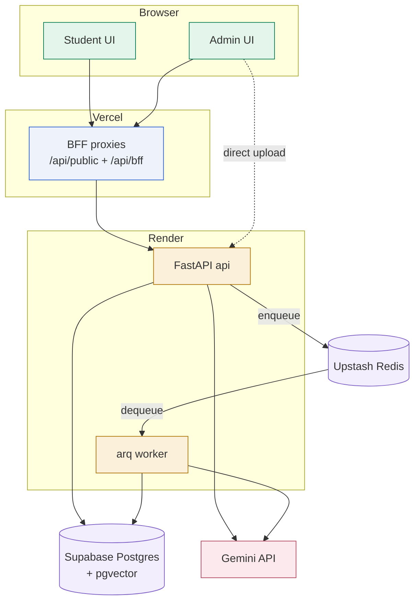

# Architecture Documentation — Degree Guidance

This folder is the complete architecture reference for the platform: how every
subsystem works, which file does what, why it's built this way, and the
production war stories behind the design. Each doc is self-contained and
cross-links to the others.

If you read only one thing first, read **`01-system-overview.md`**.

---

## The master picture

---

## Suggested reading order

1. **`01-system-overview.md`** — the whole machine + the yearly loop. *Start here.*
2. **`02-tech-stack.md`** — every technology and why (and the non-choices).
3. **`03-data-model.md`** — the database: tables, relationships, the year convention.
4. **`04-ingestion-pipeline.md`** — PDF → cutoffs (the hardest subsystem).
5. **`05-eligibility-engine.md`** — the deterministic "who can get in" core.
6. **`06-scoring-recommendations.md`** — ranking, buckets, the three tabs.
7. **`07-rag-knowledge.md`** — the from-scratch RAG (pgvector + FTS + RRF).
8. **`08-ai-agent.md`** — the framework-free tool-calling advisor.
9. **`09-admin-backend.md`** / **`10-admin-frontend.md`** — the operator console.
10. **`11-student-frontend.md`** — the student experience in code.
11. **`12-infrastructure-deployment.md`** — the split-service production topology.
12. **`13-auth-security.md`** — JWT, the BFF token injection, the guards.
13. **`14-testing-quality.md`** — the oracle and the ~353-test contract.
14. **`15-file-map.md`** — what every file does (the index).
15. **`16-design-decisions.md`** — the why + the war stories. *Read last; it ties it together.*

---

## The docs at a glance

| # | Doc | One line |
| --- | --- | --- |
| 01 | System Overview | product, audiences, the yearly loop, master diagrams |
| 02 | Tech Stack | every dependency + the deliberate non-choices |
| 03 | Data Model | tables, ER diagram, year convention, COALESCE overrides |
| 04 | Ingestion Pipeline | upload → extract → map → confirm → promote |
| 05 | Eligibility Engine | the deterministic SQL verdict |
| 06 | Scoring & Recommendations | five dimensions, buckets, ladder ordering |
| 07 | RAG Knowledge | chunk → embed → pgvector + FTS + RRF |
| 08 | AI Agent | the tool loop, five tools, injected student context |
| 09 | Admin Backend | every admin router + endpoint |
| 10 | Admin Frontend | every admin page + the review UIs |
| 11 | Student Frontend | the flow, tabs, BFF, saved-run versioning |
| 12 | Infrastructure | Render split, Supabase pooler, Upstash, artifact store |
| 13 | Auth & Security | bcrypt + JWT, BFF token injection, guards |
| 14 | Testing & Quality | the oracle, sentinels, coverage pins |
| 15 | File Map | what every file does |
| 16 | Design Decisions | principles + real production incidents |

---

## The five ideas that recur everywhere

1. **Deterministic on the critical path** — SQL, never an LLM, decides eligibility.
2. **Year-agnostic / data-derived** — nothing hardcoded per year.
3. **Additive-only migrations** — the schema only grows.
4. **Verification-first** — prove it against the printed PDF; guard it with an oracle.
5. **Fix generally, never per-case** — every fix addresses the whole class.

These are explained in full in `16-design-decisions.md`.
